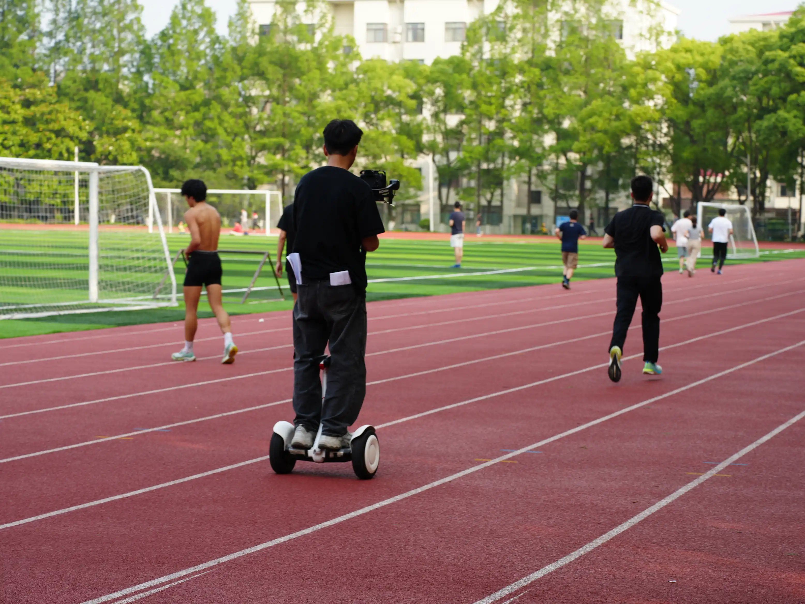

+++
title = '幕后故事：本科毕业 MV《风起青翎》'
date = 2025-06-24T15:00:00+08:00
draft = false
tag = ['music-video', 'graduation']
categories = ['art']
+++

在 2 月中下旬，我接到了负责学院毕业MV的任务。经历数个月的策划、拍摄和后期制作，终于在毕业典礼（2025
年 6 月 24 日）前完成了这部[毕业 MV][mv-link]。在这里，我想要分享一些幕后的故事以及对各位参与人员的感谢。

[mv-link]: https://www.bilibili.com/video/BV15TKGzZE9R/

<!--more-->

## 故事简介

影片从即将毕业的学生角度出发，主角当时对于自己的未来相当迷茫，不知道未来会如何发展。在经过教学楼的时候，主角停下脚步，走进了教学楼，回忆起了四年来的点点滴滴。在教学楼里，走进教室，仿佛回到了回忆中的课堂中，当时的点点滴滴涌上心头。上课、做
presentation、聚餐、参加活动、做大作业仿佛就在眼前。影片这时进入了第一段间奏，这一段间奏的内容都是一些运动的镜头，暗示的角色的变化。

进入第二段后，主角的角色发生了一些改变，从接受信息的学生变成了输出知识的助教和科研工作者。不同的方向有着不同的实验环境，因此这里有各种实验室的镜头，不同方向的同学做着不同的科研工作，但是始终不变的是那份坚持和热爱。这一段从机器人站起来作为结尾，标志着主角的成长和变化。

第二段结束后是一段间奏，主角回忆起拍毕业照的场景，这让他回想起当时的快乐与激情。于是他冲回宿舍（这时进入了第三段），换上了当时的学士服，带着满腔的热血，重新回顾了之前的一部分实验室，此时心中的迷茫已荡然无存，心中充满了对未来的期待。

最后，主角拖着行李箱，走出了学校，走到更广阔的地方，准备迎接新的挑战和未来。

### 群像

我们这部影片中的主角代表了各个方向的同学，但由于上海交通大学致远学院的特殊性，我们有八个方向，不同方向的实验方法各有不同，但主角不可能每个方向各出一人，因为这样不利于叙事。为了解决这个问题，我们整部影片只有一个主角，但是在不同的场景中，会是各个方向的同学出镜（主角因此不能作为任何一个方向的同学出镜）。在这些场景全部出现完之前，主角的正脸都不会露出来，以免给观众过早地造成印象。这样观众只知道从某个时间进入了回忆，然后各个方向的同学回忆自己的实验室经历，直到最后换上学士服，主角的正脸才会露出来，方便后面的情绪提升。

## 工作总结

在这部影片中，我是整部影片的总负责。这意味着选歌、设计画面、场景安排都需要我来决定。

从两月接到任务开始，我就开始了歌曲的策划。在这里，我要感谢卞卫阳和梁亚伦的大力帮助，整个歌曲部分都是他们负责的，没有他们的帮助，我们完成这样的一个原创作品是完全不可能的。

在歌曲的骨架确定（3月底）后，我就开始了整个 MV
的大致设计。我先确定了情绪的走向，然后逐步把每个部分的故事概要确定，再和歌曲负责人交流讨论，逐步特化到细节。

歌曲的走向和每段的时长确定后，我就开始了场景的设计。为了体现四年的经历，我把回忆部分分成了两个部分——作为学生上课和作为助教、科研工作者工作。在第一段间奏前的部分，我设计了上课、做大作业、聚餐等场景，体现了学生的生活；在第一段间奏后，我设计了实验室、助教、科研工作者等场景，体现了学生的成长和变化。

实际上，对于第三段的设计，我一开始并没有好的想法。好在其他的 MV 给了我一些启发，我决定在这段里放换学士服并回顾实验室的内容。这样的设计不仅提升了情绪，同时进一步提升主旨，也让准备迎接未来的结尾更加连贯。

在确定的故事的梗概后，我开始了具体的场景安排。此时已经是五月，大家都在忙于毕业论文和答辩，没有时间来协助我构思各方向的镜头。好在乔馨仪老师非常给力，帮我联系了各个方向的同学，大家都非常配合，给了我很多帮助。在此，我要特别感谢乔老师的帮助，她对于整个 MV 的前期工作做了很多工作，确保一切能稳步推进。

6月3日到5日是我们的拍摄日。在拍摄前，我已经准备好了分镜，并与每个镜头的同学都做了详细的沟通，确保大家都能在安排的时间点参与拍摄。同时，我也与拍摄团队进行了沟通，确保所有人都能顺利履行自己的工作。这也是我第一次担任制片的职务，因此压力其实还是挺大的。我需要确保每一个场景的拍摄都按照计划进行，因此我需要与所有出演的人员沟通，确保他们都能在指定的时间到达指定的地点；另一方面，我也要保证拍摄过程中不能出现很大的意外，不能因为一个场景拍摄晚了就影响到其他的场景。

拍摄的过程相当顺利，由于事先就预留了一些容错的空间，拍摄可以说是一点都没有翻车。可以说这是一个非常成功的制片和导演体验，在拍摄完成后，我深深地送了一口气，制片的重担总算可以放下了。在这里，我要感谢所有参与拍摄的同学们，感谢你们的配合和支持，让这部 MV 能够顺利完成。我还要着重感谢郭俊贤，他在这部 MV 中担任主演，拍摄过程非常辛苦，但他始终认真对待每一个镜头，确保每个镜头都能达到预期的效果，最终呈现出了我们想要的效果。

后期的过程实际上比预期要困难很多。在我从大连旅游回来后，我看到拍摄团队出的片子，发现有大量的地方需要修改，这让我又压力倍增。主要的问题是节奏问题，第一版的节奏前后没有变化，导致想要表现的情绪没有得到很好的体现；色彩方面，也并没有达到我想要的要求。在与后期进行了多轮的修改后（我甚至有一天下午跑到他们公司和剪辑一起改），终于在毕业典礼前完成了最终的版本。实际上，梁亚伦也反映录音棚也有类似的问题，这大概是沟通方面非常容易存在的问题，因为后期其实也不可能完全知道并理解我们的想法，会有一些不满意的地方非常正常。

## 一些小的点

### 大作业做完后庆祝的镜头

在第一段结束，有一个大作业做完后庆祝的镜头。一开始纸在空中飞舞的效果并不是很好，于是拍摄团队决定让一个场务在另一边的床上和我（我就是那个场景的演员）一同扔纸，让飞舞的纸多一点，于是就有了现在的效果。

### 跑步镜头

在第一段间奏中，有一段跑步的镜头，这段镜头中，摄影师跟着主演跑了一圈多，健身与拍摄两不误。

### 唱歌镜头

在第三段的开头 03:15 处，是蔡行之的唱歌镜头。这个镜头的位置安排是设计好的，放在主角快走之后，给人想象的空间，直到唱歌镜头结束之后，观众才能知道原来主角是要回寝室换上学士服。

MV 中唱歌的镜头除了其本身的效果外，有很多地方充当了分隔内容的作用，这个镜头就是其中之一。

### 乍浦路桥镜头

在影片的最后，是乍浦路桥上的镜头，为了这个镜头，我们5点半就起床（不过主演郭俊贤因为闹钟没响睡过头了，好在我打了电话把他叫起来），6点多从宿舍出发，7点多到达乍浦路桥。

由于乍浦路桥外景有着诸多不确定因素，乍浦路桥的人行道与非机动车道的高度落差很大，因此拍摄时充满了挑战。这个镜头我们当时花了大概五十分钟拍摄，从七点多拍到八点多，总共大概拍了三十多条素材。想来我们的主演也是深刻地理解到了什么叫永远的「保一条」和没法结束的「最后一条」了。

## 致谢

最后的最后，我要再次感谢所有为这部 MV 付出努力的老师和同学们。是你们的贡献，一份份地堆砌起了这部作品的每一个细节。感谢你们的支持与配合，也衷心地祝愿每一位 2025 届毕业生在未来的道路上都能一帆风顺，勇往直前！
