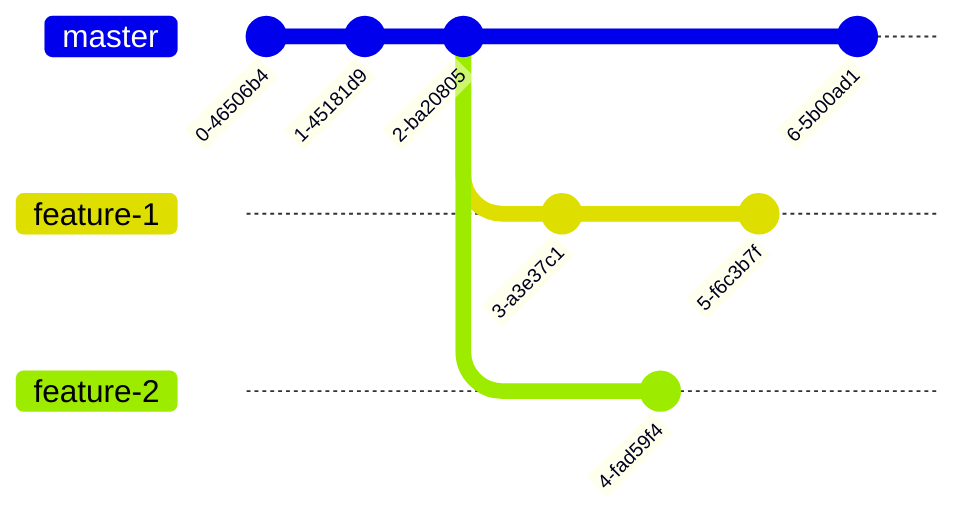

+++
title = 'Git 基础知识 - Git 是如何设计的？'
date = 2024-07-15T12:00:00-07:00
draft = false
tags = ["git", "git-zh-cn", "tutorial", "tutorial-zh-cn"]
series = "git-tutorial"
seriesAnnotation = "1/5"
showToc = true
categories = ['software']
+++

本文中，我们将探讨版本控制系统，并介绍 Git 的设计。

<!--more-->

*本文章有其他语言的版本：[English（英文）](/blog/git-basics-en)及[繁體中文（繁体中文）](/blog-zh-hk/git-basics-zh-hk)。如果你更熟悉这些语言，建议阅读这些语言的版本。*

## Git Tutorial 系列介绍

这是 Git Tutorial 系列的第一篇文章。在这个系列中，我们将介绍最常见和最有用的
Git 命令和概念。通过这个系列的知识，你将能够很好地理解 Git 并且能够熟练使用 Git。

## 版本问题

假设你现在为一个项目组工作，你的上级让你做一个项目的报告。写完报告后，你将报告命名成
`report.docx`。

过了几天，在和上级讨论时，你做了一些修改。你的上级对修改后的报告表示认可，因此你将其改名成了
`report_final.docx`。

报告发布前两天，你的上级发现了一些小问题，因此你进行了一些修改并将新版本命名成了
`report_final_v2.docx`。

过了一天，你团队里另一个成员发现了一些错别字。由于是一个很小的问题，你将版本命名成了
`report_final_v2_2.docx`。

我们注意到，这里的文件版本命名非常混乱。最终的版本 (`report_final_v2_2.docx`)
对于不知情的人来说完全没有意义。而且，仅凭借这样的版本命名，你很难知道版本之间的差异。

## 更复杂的问题⸺协作

如果我们进一步考虑协作，问题就更复杂了。如果一个人修改了报告，但是另一个人在没有同步这个变更的情况下修改了一样的地方，冲突就会发生。

你可能会认为只要我们强制所有人在编辑时必须是上线的，那么就不会发生冲突。然而，即使所有人都上线并实时同步修改，一样的问题仍然会重演。例如，两个人同时对一处地方进行不同的修改，那么冲突一定还是会发生的。

事实上，只要两个客户端尝试在**同一版本**的同一位置上进行不同的修改，无论他们上线与否，冲突一定会发生。因此，问题甚至会在只有一个修改者（但是用了多个客户端）的情况下发生。

## 版本控制系统中的概念

因此，版本控制系统应运而生。一个常见且简单的版本是共享文档。共享文档平台可以让多个用户同时修改一个文件。接下来，我们将使用共享文档平台来介绍版本控制系统中的概念。

### 记录点 (Checkpoints)

共享文档通常会提供历史记录功能，其中会记录不同时间的版本，这便是记录点
(checkpoint) 的概念。每个 checkpoint 记录了某个特定时间（或者特定情况下）的数据。


如上图所示，在如共享文档的平台中，checkpoint 会形成一条链。这和 Git
中的情况不尽相同。不过，到目前为止，你完全可以将 checkpoint
理解成上述的示意图。我们将在后面继续介绍 Git 中的 checkpoint。

### 变更

在共享文档平台中，如果你选择显示变更，你就会看到每个 checkpoint
与之前的变动。这就是变更的概念。变更指的是两个不同的 checkpoint
之间，数据中的发生变化的部分。其表明了二者之间的改动。

### 同步

同步是将最新的远程 (remote) 版本和本地 (local)
版本合并的过程。同步有两个方向，一个是将远程版本合并到本地，另一个是将本地版本同步到远端。在同步时，可能会发生以下几种情况：

1. 如果远程版本自从上次同步时没有更改，那么解决方案很简单，本地无需任何操作，（如果需要）将本地的版本更新为远端的最新版本即可。

   ```mermaid
   %%{init: {'gitGraph': {'mainBranchName': 'master'}} }%%
   gitGraph
     commit
     commit
     commit tag: "remote"
     commit
     commit
     commit tag: "local"
   ```

2. 如果远程版本自从上次同步后有更新，且本地版本自从上次同步后没有变更，那么解决方法仍然很简单，将本地版本更新成远端版本即可。

   ```mermaid
   %%{init: {'gitGraph': {'mainBranchName': 'master'}} }%%
   gitGraph
     commit
     commit
     commit tag: "local"
     commit
     commit
     commit tag: "remote"
   ```

3. 如果远程和本地都有修改（如下图），那么我们需要一些策略来将两个从同一版本派生出的不同修改同步到一起。在下一章节中，我们将着重讨论如何进行这样的合并。

    ```mermaid
    %%{init: {'gitGraph': {'mainBranchName': 'master'}} }%%
    gitGraph
      commit
      commit
      commit tag: "base"
      branch remote
      commit
      commit tag: "remote"
      checkout master
      commit
      commit
      commit tag: "local"
    ```

### 合并变更

如前所述，如果本地和远程数据都在上一次同步后发生了修改，我们需要以他们共同的父版本（或者应该叫祖先版本）为基础，对双方的修改进行合并。这就是合并变更的概念，即根据双方的修改，生成新的版本。

我们希望合并变更是自动的，除非无法完成自动合并。如果无法自动合并，合并冲突就会发生。我们将在下一章节中讨论合并冲突的问题。

### 合并冲突

虽然说在版本控制系统中，合并被设计成一个自动的流程，但合并本身并非易事。假如说，远程和本地数据库对同一位置处的文字进行了不一样的修改，那我们是保留远程的版本还是本地的版本呢？抑或是全保留？在这个情况下，绝大多数版本控制系统会让用户手动如何处理这样的冲突。

又或者说，如果两个数据库在同一行中做了不一样的修改，我们应该同时保留两个修改吗？实际上，这个问题的答案很大程度上取决于文档的类型。如果是以段落为主的文字，我们通常需要将两个修改都保留下来；如果是代码，那么我们不应该将两个修改都保留下来，而是由用户手动解决冲突。

从上面的例子中，我们可以了解到，合并冲突是指无法自动进行合并时发生的问题，其很多情况下是不可避免会出现的。

### 分支 (Branch)

在共享文档平台中，我们通常每个客户端都只有一个版本。然而，在软件开发中，我们常常要在一个客户端中使用多个版本。这是因为我们有时要在开发新功能的过程中修复原有版本的问题。根据这样的需求，我们有了分支的概念。

下图是一个多分支的例子。`master` 分支（在 GitHub 中，默认使用
 `main` 来表示主分支）是带有最新可用功能的分支，`feature-1` 和 `feature-2`
是尚未完成的新功能开发分支，`stable` 分支是最新稳定版本（通常是最新的发布版本）的分支。


## Git 是如何实现这些概念的？

在理解了版本控制系统的核心概念后，我们来看看 Git 是如何实现这些概念的。

*注：如果你忘记了概念的细节，无需担心任何问题。我们会在遇到这些细节时进行详细的解释。你只需要牢记这些核心概念（如
checkpoint、变更等）即可。*

### Git 设计架构概览

Git 是一个分布式版本控制系统。因此，每一个客户端都是一个独立的数据库。Git
跟踪的目录称为**仓库 (repository)**，简称 **repo**。Git
中所有的东西都是由当前使用的客户端出发的。下图是在某个客户端的视角下 Git
架构图。


客户端视角下，一共有两种仓库：本地和远程。本地仓库就是当前正在使用的仓库，其他仓库都是远程仓库。客户端可以将远程的仓库的变更拉取到本地，并将本地完成的变更推送到远程仓库。

### Checkpoints: Commits --- Git 版本控制的基础

与共享文档平台不同的是，Git 中的 checkpoint
需要手动添加。这是因为在文档中，修改到一半的状态是可以接受的，但是在代码中，这样的状态是不可以接受的。修改到一半的代码，会导致无法运行、运行出错等等问题。

在 Git 中，我们将这些 checkpoints 称为提交 (commit)，且每个提交都是手动添加的。每一个提交都是代码的一个快照。

另一个必须手动添加 checkpoints
的原因是我们需要一些额外信息来描述这些变更。代码并没有文档那么清晰可懂，所以我们为每个提交提供一些提示信息。这样的信息称为提交消息
(commit message)。提交消息对于再次使用这次修改（比如在另一个分支上遴选提交）以及让他人和你自己以后理解这个提交十分有用。

下图展示了提交和它们的提交消息。通常，提交消息应当短小明确，简练地概括提交中的变更。


一个提交会记录以下信息：

- 代码的快照；
- 提交消息 (commit message)；
- 作者（包括作者的名字和邮箱地址）；
- 提交者（我们在之后的博客中会解释为什么提交者可能和作者不同，现在你可以忽略提交者这件事）；
- 提交时间；
- 提交的父提交（用于记录提交间的关系可能有不止一个父提交）。

### 如何在 Git 中表示提交？

现在我们已经知道，提交是 Git 版本控制的基础。但是有一个小问题：我们应该如何表示一个提交呢？

一个最简单的方法是使用提交消息。然而，提交消息是很容易出现重复的，因此使用提交消息不是一个很好的办法。

实际上，在 Git 中，我们使用提交的哈希来表示提交。提交哈希是对提交中所有信息的哈希，包括时间、父提交的哈希等信息，鉴于哈希的散列特性，不太可能发生哈希冲突。

不过，哈希值仍然太长了。为了方便使用，Git
允许用户使用哈希的前缀来表示某个提交，只要这个前缀只能在此仓库中唯一对应到一个提交。比如，对于提交
`995fe92243b0c9e12537fca8ed8b13968bdc9085`，我们可以用 `995fe92` 来表示。

### 分支

我们在之前的章节中已经对分支进行了一些讨论。通过分支功能，我们可以轻易地在不同版本之间随意切换，并在不影响其他分支的情况下对当前分支进行修改。

我们注意到，由于提交会记录父提交，因此可能会有多个提交指向同一个父提交。



### 引用 (Reference)

我们注意到，尽管使用哈希值表示提交非常方便，然而哈希值对人来说并不方便，难以记忆。因此，在
Git 中，我们会利用引用来指向某个特定的提交。比如，分支实际上就是引用 (reference/ref)。`master`
实际上就是一个指向 `master` 分支中最新的提交的引用。其他的分支亦是如此。你可以将引用理解为如
C++ 中的引用，或者 C/C++、Go 等语言的指针。

除了分支，标签（表示特定的提交，通常被用于标记最新发布版本）也是引用。

处理上述的这些，Git 里还有一些其他的引用。比如，`HEAD` 是一个指向当前提交的引用。关于所有的引用，请见
[gitrevisions(7)](https://git-scm.com/docs/gitrevisions)。

### 工作区 (Workspace) 和暂存区 (Staging)

每个普通的仓库（而非裸仓库，bare repository）都有一个工作区，用于查看及修改文件。

在仓库的根目录下，你会看到一个名为 `.git`
的目录（你可能要启用显示隐藏文件才可以看到此目录）。在这个目录里，储存着 Git
的数据。（所以除非你知道这会导致什么后果，请不要删除这个目录！删除这个目录等同于删除除了工作区里的文件以外的所有仓库数据。）

除了 `.git` 目录以外，剩下的文件和目录就是工作区。你可以在此查看并修改工作区中的文件。

Git 还有一个专门的区域用于储存马上要提交的变更，该区域称为**暫存区
(stage/staging)**。此外，暂存区也被称为**索引区 (index)**
和 **cache**。所以当你看到 **stage**、**index**、**cache**
的时候，你应该知道他们说的是同一件事情。通过暂存区，你可以选择你要的文件进行提交，而不是必须将工作区中的所有变更一并提交。这在你需要根据不同文件添加多个提交时非常有用（你可能会在通过测试前修复多个问题，但是这些问题修复应当分开提交）。

### 远程仓库

在本章节前，所有介绍的都是本地仓库。然而，我们经常需要和别人合作，或者需要远程服务器来储存或备份代码。有很多代码托管平台可以将你的代码托管到服务器上，方便他人查看、使用，
[Github][github] 就是一个很受欢迎的代码托管平台。

[github]: https://github.com/

Git 提供了在本地和远程仓库之间同步变更的功能。在概览中，我们提到了本地和远程仓库的结构。让我们在此重新回顾一下这个结构。


请注意，本地和远程仓库之间是**相对**的关系。远程仓库可以是服务器上的一个仓库，也可以是别人电脑上的一个仓库，甚至可以是在当前设备的其他目录下的仓库。

每个仓库都可以设置多个远程仓库。这些远程仓库至少应当和本地仓库有共同的初次提交（初始提交）。如果没有，你需要强制推送或者拉取来覆盖。

添加远程仓库后，你可以将远程仓库拉取到本地的多个远程跟踪分支
(remote-tracking branch)，并使用分支合并的方法将这些变更应用到本地仓库。远程仓库称为本地仓库的**上游
(upstream)**。此外，远程仓库通常默认被命名为
`origin`（这也是所有 Git 远程操作的默认名称），但你按照你的需求修改成任意的名字。

请注意**远程**分支和**远程跟踪**分支之间的区别。远程分支是在远程服务器上的分支，而远程跟踪分支是本地仓库中的一个分支，用于跟踪远程仓库的变更。

远程分支对应的远程跟踪分支的名字通常是 `remote/branch`，其中 `remote`
是远程仓库的名字，`branch` 是远程分支的名字。比如，`origin/master` 是远程仓库
`origin` 的 `master` 分支。

关于将变更更新到远程仓库，Git 允许你将新的提交推送到远程仓库。然而，Git
只允许你推送可以快进合并的提交，也就是说，远程分支的最后一个提交是你要推送的提交的父提交。你可以使用强制推送来覆盖这个限制，但是在使用强制推送时要小心。

### 使用哈希链的好处

在前面的部分中，我们介绍了每个提交都包含了父提交哈希。这样的设计构成了一个哈希链。这个特性可以保证相同提交的父提交也是相同的。因此，如果你确定一个提交（可能来源于不可信的来源）和可信来源的提交是一样的，那么他们的祖先提交也和可信来源的提交一致。

你可能会怀疑是否有可能有一个伪造的提交导致哈希冲突。答案是肯定的，但是这个提交（或其祖先提交）必须包含一些奇怪的文件或数据。如果你没有奇怪的修改或提交消息，那么几乎不可能发生哈希冲突。

由于这个特性，你可以从其他来源下载提交。只要你检查了最新的那个提交，你就可以信任整个链。区块链也利用了这个思路。我们只需要检查最新的一个提交，就可以确定整个链是正确的。

### 回顾

下表包含了 Git 中应当牢记的核心概念。当你忘记这些概念时，可以查看这个表格。

| 概念 | 描述 |
| --- | --- |
| 提交 | 代码的一个快照 |
| 引用 (ref) | 指向某个提交的引用 |
| 分支 (branch) | 引用的一种，用来记录代码的不同分支 |
| HEAD | 引用的一种，用来表示当前所在的提交 |
| 暂存区/索引区 (stage/index/cache) | 提交前的暂存区 |
| 远程 (remote) | 一个远程仓库 |
| 远程跟踪分支 (remote-tracking branch) | 一个远程仓库的 branch 的本地副本 |

## 总结

本文中，我们讨论了版本控制系统以及 Git 是如何设计的。我们还介绍了 Git
中的核心概念。在下一篇文章中，我们会侧重于 Git 的使用，介绍 Git 的基本用法。

## 版权

你可以将本文用于任何目的，只要你在使用的地方明确标注原作者和链接
(<https://lau.yeeyu.org/blog-zh-cn/git-basics-zh-cn>)。请忽略页脚处的版权声明。
