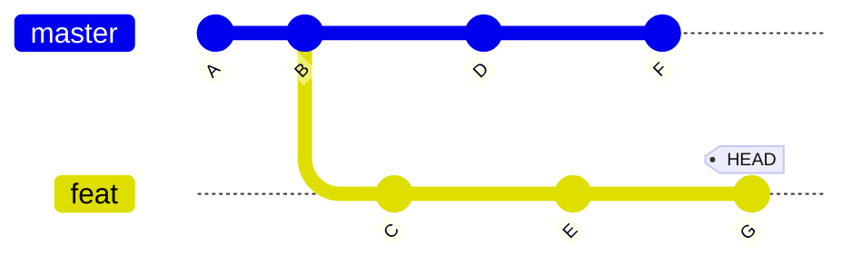
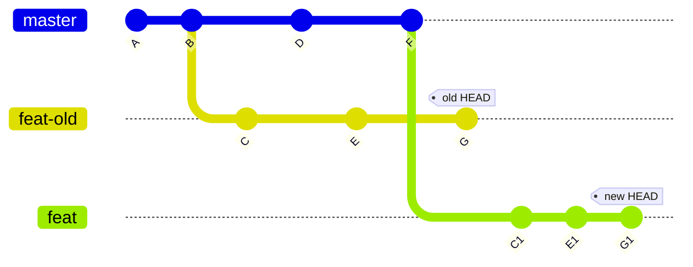

+++
title = 'Git 进阶用法：合并分支'
date = 2024-08-28T12:00:00-07:00
draft = false
tags = ["git", "git-zh-cn", "tutorial", "tutorial-zh-cn"]
series = "git-tutorial"
seriesAnnotation = "3/5"
showToc = true
+++

在[上一篇文章](/blog-zh-cn/git-basic-usage-zh-cn)中，我们介绍了 Git
的基础用法。在本文中，我们将介绍合并分支以及其相关用法。

<!--more-->

*本文章有其他语言的版本：[English（英文）](/blog/git-usage-merging-en)及[繁體中文（繁体中文）](/blog-zh-hk/git-usage-merging-zh-hk)。如果你更熟悉这些语言，建议阅读这些语言的版本。*

在 Git 中，我们时常会使用多个分支来提升工作效率，使工作流程更加灵活。然而，对于初学者来说，理解并使用这些功能并非易事，尤其是合并分支相关的功能。如果你对关键命令和概念不够了解，那么在处理多个分支时遇到问题时，你可能会不知所措。本文将介绍这些部分的用法，让读者更好地理解这些功能。

本文将假设你已经掌握了基础用法。这些用法在[上一篇文章](/blog-zh-cn/git-basic-usage-zh-cn)中有介绍。具体来说，你应该熟悉[回顾表格](/blog-zh-cn/git-basic-usage-zh-cn#回顾)中列出的内容。

## 合并分支

**关键点：始终在自己的分支上进行操作。**

Git 是为分布式目的而设计的，因此你应该以自己的分支为核心分支。每次你想做一些操作（例如
`merge` 或 `rebase`）时，建议在自己的分支上操作。我们将在 `git rebase` 部分给出更多示例。

Git 提供了两种合并分支的方法：

- [合并 (merge)](#合并-merge)
- [变基 (Rebase)](#变基-rebase)

两种方法各有优劣，而且在工作流程上也有所不同。请根据自己的情况（例如个人偏好、团队规则等）选择合适的方法。

在合并分支时，如果双方修改了同一部分文件，可能会发生冲突。我们将在本文后面讨论如何解决冲突。

### 合并 (Merge)

合并大概有两种行为：

- **快进合并**。如果 `HEAD` 是要合并的分支的祖先，Git 只会将 `HEAD`
  移动到要合并的分支。你可以使用 `--ff-only`
  选项来强制执行这种行为。下面的图表描述了快进合并。如果我们在 `master`
  分支上，想要合并 `feat` 分支，那么 `HEAD` 将移动到 `feat` 分支，也就是从
  `old HEAD` 位置移动到 `new HEAD` 位置。

  ```mermaid
  %%{init: {'gitGraph': {'mainBranchName': 'master'}} }%%
  gitGraph
    commit
    commit tag: "old HEAD"
    branch feat
    commit
    commit tag: "new HEAD"
  ```

- **三方合并**。如果 `HEAD` 不是要合并的分支的祖先，Git
  将创建一个新的提交来合并这两个分支。下面的图表描述了三方合并。此时，新的提交有两个父提交：要合并的分支的最后一个提交和你之前所在的提交。

要合并分支，你可以使用以下命令：

```bash
git merge <commit>...
```

> 例如，如果你在 `master` 分支上，想要合并 `feat` 分支，你可以使用以下命令：
>
> ```bash
> git merge feat
> ```

请注意：

- `<commit>` 参数可以是提交哈希或任何提交的引用。
- 要合并的提交数量可以是多个。
- 如果没有指定提交，Git 将合并当前分支的远程跟踪分支。
- 使用 `--ff-only` 选项来强制快进合并（例如，`git merge --ff-only feat`）。
- 使用 `--squash` 选项（例如，`git merge --squash feat`）以实现合并但不创建新提交或避免创建合并提交（也就是有多个父提交）。

我们将在后面讨论如何解决合并分支时的冲突。

优点：

- 不会影响之前的提交，包括提交者、作者和签名。

缺点：

- 提交之间的关系复杂，不够清晰。
- 当合并的分支有大量提交时，冲突解决过程可能会复杂，与变基的情况相比。这是因为变基过程会逐个应用提交，因此更细粒度。

### 变基 (Rebase)

变基与合并有所不同。如果提交关系如下图所示：



然后，将 `master` 分支变基到 `feat` 分支后，图表将如下所示：



`feat` 分支已经变基到了 `master` 分支，提交 `C`、`E`、`G` 已经应用到了
`master` 分支的最新提交上。`C1`、`E1`、`G1` 是变基操作创建的新提交。本质上，变基是将原来的基底从公共祖先变成了要变基的分支。

在实际操作中，rebase 操作是将所有受影响的分支（包括从公共祖先到当前分支的所有分支）逐个应用到要变基的分支上。这就是为什么它被称为变基，因为它将当前分支的基底从公共祖先设置为要变基的分支。

请注意，你应该是要变基的分支的唯一维护者。否则，你可能会遇到很多问题。

要变基分支，你可以使用以下命令：

```bash
git rebase <commit>
```

> 例如，如果你在 `feat` 分支上，想要变基到 `master` 分支，你可以使用以下命令：
>
> ```bash
> git rebase master
> ```

请注意：

- `<commit>` 参数可以是提交哈希或任何提交的引用。
- 如果没有指定提交，Git 将变基当前分支的远程跟踪分支。
- 如果发生冲突，你应该解决冲突，然后使用 `git rebase --continue` 继续变基操作。我们将在本文后面讨论如何解决冲突。

如果你想使用更多功能，你可以使用 `-i` 或 `--interactive` 选项。这将打开一个编辑器，允许你执行以下操作：

- Pick (`p <commit>`): 应用提交。
- Reword (`r <commit>`): 应用并修改提交文字信息。
- Edit (`e <commit>`): 应用提交但不直接自动提交，以便手动修改提交。
- Squash (`s <commit>`): 应用提交但不产生新提交。
- Fixup (`f <commit>`): 类似于 `squash`，但不保留提交信息。
- Execute (`x <command>`): 执行命令（任何的命令行命令）。
- Break (`b`): 在此处停止（使用 `git rebase --continue` 以继续）。
- Drop (`d <commit>`): 移除提交。
- Label (`l <label>`): 将当前 `HEAD` 打上标签。
- Reset (`t <label>`): 将当前 `HEAD` 移到某个标签。
- Merge (`m [-C <commit> | -c <commit>] <label> [# <oneline>]`): 合并提交。
- Update-ref (`u <ref>`): 为引用设立占位符，以将这个引用更新为此处的新提交。

优点：

- 创建的提交被保留为一个链，相比之下更清晰易懂。
- 如果要变基的提交与当前分支有很大差异，冲突解决会更容易，因为变基过程会逐个应用提交。

缺点：

- 如果要变基的提交的提交者不是执行变基操作的人，那么这些提交将失去原始提交者（以及签名）。
- 如果有两个或两个以上的人在同一个分支上工作，那么分支可能不会是最新的，这意味着你必须手动遴选提交（如果你是分支的唯一维护者，你不会遇到这个问题）。
- 可能会发生更多的冲突，但这种情况很少见。

### 解决冲突

> [!TIP]
> 只要需要合并，冲突一定有可能发生。

在合并分支时，Git 会告诉你是否自动合并失败。如果自动合并失败，你必须手动解决冲突。

你可以使用 `git status` 命令查看合并的状态。在有冲突的文件中，你会看到类似以下消息：

```plaintext
<<<<<<< HEAD
...
||||||| b6279c7
...
=======
...
>>>>>>> feat
```

第一个 `...` 是当前 `HEAD` 的内容；第二个 `...` 是共同祖先的内容；第三个 `...`
是要合并的内容。

你也可以使用其他工具（例如 [delta 项目][delta-project]）以更直观的方式来显示冲突，我们将在接下来的文章中介绍如何配置和使用。

[delta-project]: https://github.com/dandavison/delta

如果你使用 rebase，解决冲突会更容易，因为每个提交的变化更细粒度，有明确的意图（变更是逐个提交应用的）。

解决冲突后，你应该根据你的合并策略使用以下命令：

- 对于合并策略，添加解决的文件（例如，`git add <file>`），然后创建一个新的提交（例如，`git commit`）。
- 对于变基策略，添加解决的文件（例如，`git add <file>`），然后继续变基操作（例如，`git rebase --continue`）。

还有一些其他「小技巧」：

- 「走为上计」：`git merge --abort`、`git rebase --skip`、`git rebase --abort`（取决于你使用的策略）。
- 「言听计从」：`git merge -s theirs ...`。
- 「固执己见」：`git merge -s ours ...`。

### 常见工作流程示例

假设主分支是 `master`，功能分支是 `feat`。我们需要将 `feat` 分支合并到 `master`
分支，但 `master` 分支无法快进合并 `feat` 分支。

- 合并策略：在 `master` 分支上合并 `feat` 分支。

  推荐这样做之后再切换到 `feat` 分支，并以快进合并的方式将 `master`
  分支合并。这将使 `feat` 分支与 `master`
  分支保持一致。如果你不这样做，短期内不会有什么问题，但随着变更的积累，冲突或其他问题（例如，没有冲突但不能正确运行）将更有可能发生。
- 变基策略：在 `feat` 分支上变基 `master` 分支，然后切换到 `master`
  分支，并以快进合并的方式将 `feat` 分支合并。

## 相对引用

当你在多个分支上工作时，相较于使用哈希值，提交的相对关系更有意义。有时，用某个提交的相对关系来表达另一个提交会更加方便且明确（如
`HEAD` 的父提交）。

因此，Git 提供了一种相对引用的表达方式（比如，`HEAD^` 表示父提交，`HEAD~2`
表示 `HEAD` 的父提交的父提交）。规则如下：

- `<rev>~<n>`：`<rev>` 的第 `n` 代祖先提交。例如：
  - `HEAD~0`：等价于 `HEAD`。
  - `HEAD~1`：`HEAD` 的父提交。
  - `HEAD~n`：`HEAD` 的第 `n` 代祖先提交。
- `<rev>^<n>`：在多个父提交的情况下切换（`git merge`
  产生的提交有多个父提交）。注意：`^` 单独表示「父提交」，`n`
  用于在一个或多个父提交中切换（如果超出父提交的数量，将会出现错误）。`n`
  表示 `<rev>` 的第 `n` 个父提交。例如，`HEAD^`（等价于 `HEAD^1`）和 `HEAD^2`。

> [!WARNING]
> `^` 和 `~` 可能是你的 shell 的特殊字符，所以如果是特殊字符，你应该转义它们。
>
> 1. 在 bash 中，它们不是特殊字符，所以你不需要转义它们。
> 2. 在 zsh 中，`^` 是特殊字符，所以你应该使用 `\` 转义它，或者使用单引号来避免触发
>    shell 内置的转换（例如，`HEAD\^` 或 `'HEAD^'`）。

## 暂时储藏 (Stash)

有时，你需要切换到另一个分支，但又没有打算提交当前分支的更改。在这种情况下，如果直接切换到另一个分支，Git
可能会因为当前分支的更改（这种情况只会在当前分支和另一个分支的文件不同的情况下发生）而拒绝切换。

因此，Git 允许你暂时地储藏更改，以便稍后随时使用。具体来说，Git
有一个修改栈，记录了所有暂时储藏的更改。你可以使用以下命令使用此功能：

1. 储藏更改：

   ```bash
   git stash
   ```

2. 恢复更改：（你可能需要解决冲突，使用 `git status` 显示更多信息）

   ```bash
    git stash pop
    ```

3. 列出储藏的更改：

   ```bash
   git stash list
   ```

4. 清除所有储藏的更改：

   ```bash
   git stash clear
   ```

## 获取共同祖先

在某些情况下，你可能需要获取多个分支（通常是两个）的共同祖先。你可以使用以下命令获取共同祖先：

```bash
git merge-base --all <commit>...
```

> 例如，如果你想获取 `master` 和 `feat` 分支的共同祖先，你可以使用以下命令：
>
> ```bash
> git merge-base --all master feat
> ```

## 从提交中恢复文件到工作目录

如果你误删了已提交的文件或目录，你可以使用以下命令将其恢复到工作目录：

```bash
git restore <path>...
```

请注意，这个操作会丢弃所有已更改的文件，因此可能会有风险。为了更安全地实现类似的功能，你也可以[暂时储藏更改](#暂时储藏-stash)。

> 例如，如果你误删了 `README.txt` 文件，你可以使用以下命令将其恢复：
>
> ```bash
> git restore README.txt
> ```

如果你想恢复的文件源不是 `HEAD`，你可以使用 `--source=<tree>` 选项指定。`<tree>` 可以是提交哈希或任何提交的引用。例如，如果你想从 `HEAD` 的父提交中恢复 `README.txt` 文件，你可以使用以下命令：

```bash
git restore --source=HEAD~ README.txt
```

如果你的 Git 版本不支持 `git restore` 命令，你可以使用 `git checkout` 命令代替。用法与 `git restore` 命令类似：

```bash
git checkout <path>...
```

> 例如，如果你在前面的例子中误删了 `README.txt` 文件，你可以使用以下命令：
>
> ```bash
> git checkout README.txt
> ```

## 取消暂存

如果你误将文件添加到暂存区，你可以使用以下命令取消暂存：

```bash
git restore --staged <path>...
```

> 例如，如果你误将 `README.txt` 文件添加到暂存区，你可以使用以下命令取消暂存：
>
> ```bash
> git restore --staged README.txt
> ```

如果你的 Git 版本不支持 `git restore` 命令，你可以使用 `git reset` 命令代替：

```bash
git reset HEAD <path>...
```

> 例如，如果你在前面的例子中误将 `README.txt` 文件添加到暂存区，你可以使用以下命令：
>
> ```bash
> git reset HEAD README.txt
> ```

## 清理工作目录

如果你发现你的工作目录中有很多未跟踪的文件，你可以使用以下命令清理它们：

```bash
git clean -i
```

`-i` 选项表示「交互」，这意味着它会提示你是否删除未跟踪的文件。使用 `-i`
选项时，你也可以指定想要删除的文件。如果你不想使用交互模式，或者你需要在脚本中使用这个命令，你应该去掉这个选项。此外，你可以使用
`-f` 选项强制删除。

## 重置分支的 HEAD 提交

有时，我们可能需要将某个分支的 HEAD 提交更改为另一个提交（例如，当前 HEAD 的父提交）。

如果你不在你想要更改的分支上，请先切换到该分支。然后，你可以使用以下命令实现：

```bash
git reset [--soft | --mixed | --hard | --merge | --keep] <commit>
```

根据 [git reset 文档](https://git-scm.com/docs/git-reset)所说，`--soft`、`--mixed`、`--hard`、`--merge`
和 `--keep` 选项的含义如下：

- `--soft`：不会对暂存的文件或工作目录进行任何更改（但是会将 HEAD 重置为
  `<commit>`，就像所有模式一样）。这将使所有更改的文件变为待提交文件。
- `--mixed`（默认）：重置暂存区但不重置工作目录（即更改的文件会被保留，但不会标记为提交），并报告未更新的文件。
- `--hard`：重置暂存区和工作目录。自 `<commit>` 以来对工作目录中已跟踪文件的任何更改都将被丢弃。任何在写入任何已跟踪文件的路径上的未跟踪文件或目录都将被直接删除。
- `--merge`：重置暂存区并更新工作目录中 `<commit>` 和 `HEAD`
  之间不同的文件，但保留暂存区和工作目录之间不同的文件（即具有未添加的更改的文件）。如果
  `<commit>` 和暂存区之间的文件之间有不同的文件具有未提交的更改，操作将被中止。
- `--keep`：重置暂存区的内容并更新工作目录中 `<commit>` 和 `HEAD`
  之间不同的文件，并将其余的文件（包括暂存的和未暂存的）当作未暂存的[^1]。如果
  `<commit>` 和 `HEAD` 之间的文件之间有未提交的更改，重置将被中止。

[^1]: 原文中没有直接提及所有其他文件（包括暂存或未暂存的）都被视为未暂存。这部分是为了使解释更清晰而添加的。

> 例如，如果你想将 `master` 分支的 HEAD 提交更改为其父提交，并重置索引和工作目录，你可以使用以下命令：
>
> ```bash
> git reset --hard HEAD~
> ```

## 显示差异

在 Git 中，有四种常见的显示差异的情况：

- [显示工作目录和某些提交之间的差异](#显示工作目录和某些提交之间的差异)
- [显示暂存区和某些提交之间的差异](#显示暂存区和某些提交之间的差异)
- [显示提交之间的差异](#显示提交之间的差异)
- [生成补丁](#生成补丁)

### 显示工作目录和某些提交之间的差异

使用以下命令显示工作目录和某些提交之间的差异：

```bash
git diff <commit>
```

> 例如，如果你想显示工作目录和 `feat` 分支之间的差异，你可以使用以下命令：
>
> ```bash
> git diff feat
> ```

特别地，如果你想查看工作目录和当前 `HEAD` 之间的差异，你可以直接运行：

```bash
git diff
```

要显示某些文件或目录的差异，你可以指定它们：

```bash
git diff <commit> <path>...
```

> 例如，如果你想显示 `README.txt` 文件的工作目录和 `feat`
> 分支之间的差异，你可以使用以下命令：
>
> ```bash
> git diff feat README.txt
> ```

### 显示暂存区和某些提交之间的差异

使用以下命令显示暂存区和某些提交之间的差异（与前面的情况类似，只需添加 `--cached` 选项）：

```bash
git diff --cached <commit>
```

与前面的情况类似，你可以省略 `<commit>` 参数以显示暂存区和当前
`HEAD` 之间的差异。你也可以指定文件或目录以显示差异。

### 显示提交之间的差异

使用以下命令显示两个提交之间的差异：

```bash
git diff <commit> <commit>
```

> 例如，如果你想显示 `master` 和 `feat` 分支之间的差异，你可以使用以下命令：
>
> ```bash
> git diff master feat
> ```

与前面的情况类似，你可以指定文件或目录以显示差异：

```bash
git diff <commit> <commit> <path>...
```

### 生成补丁

要为任何差异生成补丁，你只需要将前面的情况的输出重定向到一个文件。

> 例如，如果你想为当前工作目录和 `HEAD` 之间的差异生成一个补丁文件 `patch.diff`，你可以使用以下命令：
>
> ```bash
> git diff > patch.diff
> ```

在下一部分中，我们将介绍如何应用补丁。

## 应用补丁

要应用补丁，你可以运行：

```bash
git apply <patch>
```

> 例如，如果你想应用 `patch` 目录中的 `patch.diff` 补丁，你可以使用以下命令：
>
> ```bash
> git apply patch/patch.diff
> ```

## 显示提交

要显示提交的详细信息，你可以使用以下命令：

```bash
git show <commit>
```

> 例如，如果你想显示当前 `HEAD` 的父提交的详细信息，你可以使用以下命令：
>
> ```bash
> git show HEAD~
> ```

## 回退提交

如果我们在某些提交中做了错误的更改（例如，在解决一个 bug 时引入了另一个更严重的
bug），我们可以回退这些提交。你可以使用以下命令回退提交：

```bash
git revert <commit>...
```

这将逐个回退每个提交。请注意，每个回退的提交都会创建一个新的提交。如果你不想创建多个提交，你可以使用
`--no-commit` 或 `-n` 选项。

> 例如，如果你想回退 `614b994` 和 `d4be492` 两个提交，你可以使用以下命令：
>
> ```bash
> git revert 614b994 d4be492
> ```
>
> 这将创建两个新的提交。

## 遴选 (Cherry-pick) 提交

有时，我们可能需要将其他分支的提交应用到当前分支。例如，我们有一个开发分支和一个用于生产的主分支。开发分支可能有一些修复关键
bug 的提交，我们希望将它们应用到主分支。在这种情况下，我们希望将这些更改应用到主分支。

Git 提供了 `cherry-pick` 命令来将提交应用到当前分支。要遴选提交，你可以使用以下命令：

```bash
git cherry-pick <commit>...
```

此操作将逐个应用提交。与 `revert` 命令类似，每个遴选的提交都会创建一个新的提交。如果你不想创建多个提交，你可以使用
`--no-commit` 或 `-n` 选项。

> 例如，如果你想遴选 `614b994` 和 `d4be492` 两个提交，你可以使用以下命令：
>
> ```bash
> git cherry-pick 614b994 d4be492
> ```
>
> 这将创建两个新的提交。

## 在文件中查找特定内容

如果你想在文件中查找特定内容（例如，一个字符串），你可以使用以下命令：

```bash
git grep <pattern> <path>...
```

如果你没有指定 `<path>`，Git 将在整个仓库中搜索。`pattern` 与 `grep` 命令中的模式类似。

> [!TIP]
> 此命令有其他替代方案（例如 [rip-grep][ripgrep]），我们将在接下来的文章中介绍。

[ripgrep]: https://github.com/BurntSushi/ripgrep

## 显示引用日志

在基本使用文章中，我们提到如果提交了更改，那么更改可以很容易地被检索。这是因为 Git
有一个引用日志，记录了所有关于提交的更改。你可以使用引用日志查看与提交相关的所有操作。要显示引用日志，你可以运行：

```bash
git reflog
```

## 管理远程仓库

在基本使用文章中，我们介绍了如何添加远程仓库。在这里，我们将介绍更多的命令来管理远程仓库。

### 列出远程仓库

要列出所有远程仓库，你可以使用以下命令：

```bash
git remote show
```

使用 `--verbose` 或 `-v` 选项显示更多细节：

```bash
git remote -v show
```

要列出特定的远程仓库，你可以运行：

```bash
git remote show <repo>
```

> 例如，如果你想显示 `origin` 仓库的详细信息，你可以使用以下命令：
>
> ```bash
> git remote show origin
> ```

### 添加新的远程仓库

这已经在基本使用文章中介绍过了。使用以下命令添加新的远程仓库：

```bash
git remote add <name> <url>
```

### 移除远程仓库

要移除远程仓库，你可以使用以下命令：

```bash
git remote remove <name>
```

> 例如，如果你想移除 `origin` 远程仓库，你可以使用以下命令：
>
> ```bash
> git remote remove origin
> ```

### 修改远程仓库地址

要修改远程仓库地址，你可以使用以下命令：

```bash
git remote set-url <name> <url>
```

> 例如，如果你想将 `origin` 远程仓库修改为 `git@github.com:github/gitignore.git`，你可以执行以下命令：
>
> ```bash
> git remote set-url origin git@github.com:github/gitignore.git
> ```

### 重命名远程仓库

要重命名远程仓库，你可以使用以下命令：

```bash
git remote rename <old-name> <new-name>
```

## 回顾

现在，让我们回顾一下本文和前一篇文章中介绍的用法。

| 命令 | 描述 | 备注 |
| --- | --- | --- |
| `git init` | 初始化一个新仓库 | 当前目录不能是一个已存在的仓库 |
| `git clone <url>` | 复制一个已存在的仓库 | 目标目录不能存在 |
| `git add <path>` | 将 `<path>` 中的更改添加到暂存区 | 提交只会应用于添加到暂存区的文件 |
| `git status` | 检查仓库的状态 | 推荐在提交前使用 |
| `git diff` | 显示差异 | 使用 `--cached` 显示暂存区的差异；可以指定路径 |
| `git commit` | 进行一次提交 | 如果消息很短，使用 `-m`；经常提交（文件的更改在大多数情况下很容易找回） |
| `git log` | 显示提交历史 | 使用 `--oneline` 让每个提交只占用一行；使用 `--graph` 显示提交图 |
| `git remote add origin <url>` | 添加一个远程仓库 | 远程仓库的默认名称是 `origin`；你可能需要遵循第一次推送时的指示（例如，`git push --set-upstream origin master`） |
| `git remote show` | 列出远程仓库 | 使用 `-v` 显示更多细节；你可以通过名称指定仓库 |
| `git remote set-url origin <url>` | 修改远程仓库地址 | |
| `git remote remove origin` | 移除远程仓库 | |
| `git remote rename origin new-origin` | 重命名远程仓库 | |
| `git push` | 将更改推送到远程仓库 | 如果快进合并策略失败，使用 `--force` 强制推送（这会丢弃一些提交） |
| `git fetch` | 从远程仓库抓取更改 | 如果你想抓取非默认分支，使用 `git fetch <repo>` |
| `git pull` | 从远程仓库抓取并合并更改 | 默认的合并策略可能不同 |
| `.gitignore` | 忽略文件 | 使用 `.gitignore` 忽略你不想提交的文件 |
| `git branch <branch>` | 添加一个新分支 | 新分支名称不能存在；另一种解决方案：`git checkout -b <branch>` |
| `git switch <branch>` | 切换到另一个分支 | 对于其他引用，请加上 `--detach`；另一种解决方案：`git checkout <branch>` |
| `git merge <branch>` | 合并分支 | 使用 `--ff-only` 强制快进合并；使用 `--squash` 合并但不创建新提交或避免创建合并提交 |
| `git rebase <branch>` | 变基分支 | 使用 `-i` 或 `--interactive` 使用更多功能 |
| `<rev>~<n>` | 获取 `<rev>` 的第 `n` 代祖先提交 | |
| `<rev>^<n>` | 获取 `<rev>` 的第 `n` 个父提交 | `^` 单独表示「父提交」 |
| `git stash` | 暂时储藏更改 | 使用 `pop`、`clear` 和 `list` 检索、清除所有、列出储藏的更改 |
| `git merge-base --all <commit>...` | 获取共同祖先 | |
| `git restore <path>` | 从提交中恢复文件到工作目录 | 使用 `--source=<tree>` 指定源；另一种解决方案：`git checkout <path>` |
| `git restore --staged <path>` | 取消暂存 | 另一种解决方案：`git reset HEAD <path>` |
| `git clean` | 清理工作目录 | 使用 `-i` 交互模式；使用 `-f` 强制删除 |
| `git reset <commit>` | 更改分支的 HEAD 提交 | 选项：`--soft`、`--mixed`、`--hard`、`--merge` 或 `--keep` |
| `git apply <patch>` | 应用补丁 | |
| `git show <commit>` | 显示提交 | |
| `git revert <commit>...` | 回退提交 | 使用 `--no-commit` 或 `-n` 避免创建多个提交 |
| `git cherry-pick <commit>...` | 遴选提交 | 使用 `--no-commit` 或 `-n` 避免创建多个提交 |
| `git grep <pattern> <path>...` | 在文件中查找特定内容 | 如果未指定路径，将在整个仓库中搜索 |
| `git reflog` | 显示引用日志 | |

## 总结

在本文中，我们介绍了 Git 的高级用法，重点介绍了与合并分支相关的命令。希望通过这篇文章，你可以熟练掌握管理多个分支的技巧。我们将在下一篇文章中介绍子模块的用法。

## 版权

你可以将本文用于任何目的，只要你在使用的地方明确标注原作者和链接
(<https://lau.yeeyu.org/blog-zh-cn/git-usage-merging-zh-cn>)。请忽略页脚处的版权声明。
