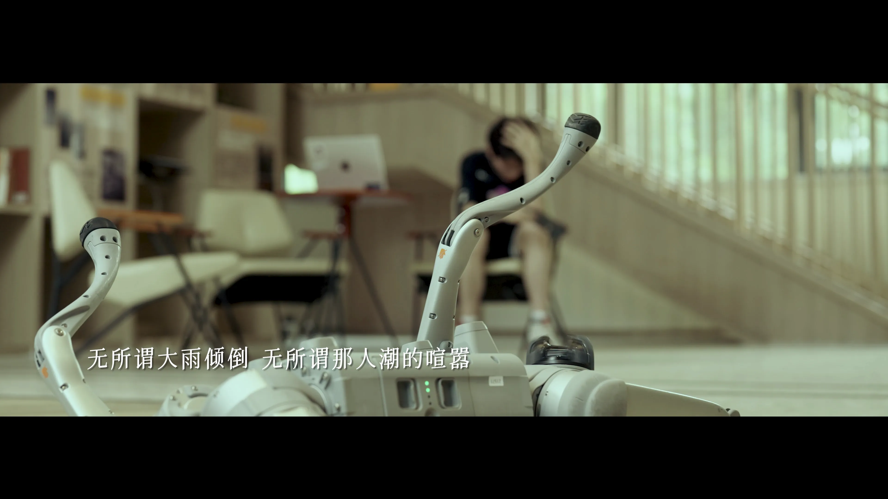

+++
title = '幕後故事：畢業 MV《風起青翎》'
date = 2025-06-24T15:00:00+08:00
draft = false
tag = ['music-video', 'graduation']
categories = ['art']
+++

在 2 月中下旬，我接到了負責學院畢業 MV 的任務。經歷數個月的策劃、拍攝和後期製作，終於在畢業典禮（2025 年 6 月 24 日）前完成了這部[畢業 MV][mv-link]。在這裏，我想分享一些幕後的故事，表達對各位參與人員的感謝。

[mv-link]: https://www.bilibili.com/video/BV15TKGzZE9R/

<!--more-->

## 故事簡介

影片從即將畢業的學生角度出發，主角當時對自己的未來感到相當迷惘，不知道前路將如何發展。經過教學樓時，主角停下腳步，走進了教學樓，回憶起四年來的點點滴滴。在教室中，他彷彿回到了當時的課堂，過往的記憶湧上心頭。上課、做 presentation、聚餐、參加活動、完成大作業的一幕幕仿如昨日。影片隨後進入第一段間奏，這一段以運動鏡頭為主，象徵角色的轉變。

進入第二段後，主角的身份發生改變，從接收知識的學生轉變為傳授知識的助教和科研工作者。不同方向有不同的實驗環境，因此此段展現了各式各樣的實驗室場景，各方向的同學從事着不同的科研工作，但不變的是那份堅持與熱愛。這一段以機械人站起來作結，象徵主角的成長與蛻變。

第二段結束後是一段間奏，主角回憶起拍畢業照的場景，勾起當時的快樂與熱情。於是他衝回宿舍（此時進入第三段），換上了當時的學士服，滿懷熱血地重新走訪之前的一些實驗室，心中的迷惘已一掃而空，對未來充滿了期待。

最後，主角拖着行李箱走出校園，踏上更廣闊的天地，準備迎接新的挑戰與未來。

### 群像

本片的主角象徵各個學科方向的同學。由於上海交通大學致遠書院的特殊性，共有八個方向，各方向的實驗方式也不盡相同。若每個方向安排一位主角，將不利於敘事連貫性。因此我們選擇以一位主角貫穿全片，在不同場景中由不同方向的同學出演（因此主角本人不參與各方向場景的拍攝）。在這些場景全部出現前，主角的正臉始終不會露出，以免觀眾產生過早印象。這樣觀眾只知道進入了回憶情境，然後由各方向的同學回顧自身實驗經歷，直到換上學士服時，主角的正臉才終於亮相，為情感鋪陳提供助力。

## 工作總結

在這部影片中，我擔任整體總負責，選歌、畫面設計、場景安排皆由我統籌決定。

從二月接下任務開始，我便展開歌曲策劃。在此要特別感謝卞衛陽與梁亞倫的鼎力協助，整段歌曲皆由他們負責，若無他們，此原創作品絕無可能完成。

三月底歌曲骨架確立後，我隨即着手 MV 的整體設計。我首先確定情緒起伏走向，再逐步具體化每段故事概要，並與音樂負責人多番討論，逐步細化至具體細節。

當歌曲結構與時長確定後，我開始設計場景。為了呈現四年的成長歷程，我將回憶分為兩部分——作為學生上課，以及作為助教與科研人員工作。第一段間奏前的內容為上課、做大作業、聚餐等，展現學生生活；間奏之後則為實驗室、教學與研究工作，反映學生的成長與轉變。

實際上，對於第三段的設計，我最初並無明確構思。幸而觀摩了其他 MV，得到靈感，決定安排換上學士服並回顧實驗室經歷的段落。此設計不僅增強了情感渲染，也進一步深化主旨，使結尾過渡至迎向未來更為自然流暢。

故事大綱確定後，我便着手具體場景安排。當時已進入五月，大家都忙於畢業論文與答辯，無暇協助構思各方向的鏡頭。幸好有喬馨儀老師熱心協助，幫我聯繫了各方向的同學，大家都非常配合，給予我莫大幫助。謹此向喬老師致以誠摯感謝，她在前期工作中出力良多，確保整體工作得以順利推進。

6 月 3 至 5 日為拍攝日。在此之前，我已準備好分鏡腳本，並與每位演員細緻溝通，確保能按時拍攝。同時亦與攝影團隊保持溝通，確保各崗位順利履行。這也是我首次擔任製片一職，壓力着實不小。我需確保每場拍攝按計劃進行，與演員保持聯繫以確認時間與地點；另一方面，也要避免拍攝過程中出現重大失誤，不致影響後續拍攝排程。

拍攝過程非常順利，因事先預留了容錯空間，幾乎沒有失誤。這次製片與導演經驗堪稱成功，拍攝結束後，我也終於鬆了一口氣。我要感謝所有參與拍攝的同學，感謝你們的配合與支持，讓這部 MV 順利完成。特別感謝主演郭俊賢，他在拍攝中十分辛勞，但始終認真對待每一鏡，確保效果達到預期，最終呈現出我們心目中的畫面。

後期製作實際上比預期困難許多。我從大連旅遊歸來後，看了拍攝團隊初剪版本，發現需修改的地方不少，頓感壓力倍增。主要問題為節奏感不足，前後段落變化不明顯，難以承載情緒轉折；而色彩方面亦未達標。經多輪修訂（我甚至有一天下午跑到剪輯公司與剪輯師共同調整），終於在畢業典禮前完成了最終版本。事實上，梁亞倫也表示錄音棚部分出現類似問題。這些大多為溝通不暢所致，畢竟後期團隊無法完全理解我們的創作意圖，產生偏差實屬正常。

## 一些小點

### 大作業完成後的慶祝鏡頭

第一段結束處有個慶祝完成大作業的鏡頭。起初紙張在空中飄舞的效果並不理想，攝影團隊決定安排一位場務在對面床上與我（我就是該場景演員）一同拋紙，增加飄舞感，最終才呈現出現在的畫面。

### 跑步鏡頭

第一段間奏中有一段操場跑步鏡頭，攝影師跟隨主演跑了一圈多，健身與拍攝兼顧。

### 唱歌鏡頭

第三段開頭 03:15 處，是蔡行之的演唱鏡頭。這一鏡頭特意安排在主角快步行走之後，營造想像空間。直到唱完，觀眾才發現主角原來是要回宿舍換上學士服。

MV 中的演唱鏡頭除了展現歌聲本身外，也常作為段落間的分隔點，這一幕正是其中之一。

### 乍浦路橋鏡頭

影片最後為乍浦路橋場景。為了這一鏡頭，我們凌晨五點半便起床（不過主演郭俊賢因鬧鐘沒響而睡過頭，好在我打電話將他叫醒），六點多從宿舍出發，七點多抵達橋上。

由於橋上拍攝受諸多不確定因素影響，且行人道與非機動車道之間有高低落差，整個拍攝充滿挑戰。我們花了約五十分鐘拍攝，自早上七時多拍至八時多，共錄下三十多條素材。相信主演也深刻體會到永遠的「保一條」與沒完沒了的「最後一條」是甚麼感覺了。

## 致謝

最後的最後，我衷心感謝所有為這部 MV 付出努力的老師與同學們。正是你們的點滴貢獻，才堆砌出這部作品的每個細節。感謝你們的支持與配合，亦祝願每位 2025 屆畢業生未來一帆風順，勇往直前！
