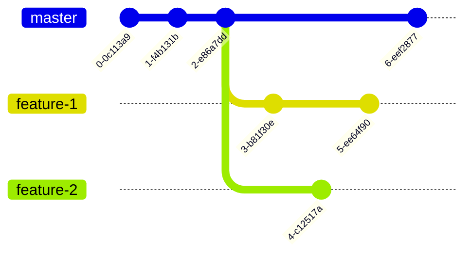

+++
title = 'Git 基礎知識 - Git 是如何設計的？'
date = 2024-07-11T12:00:00-07:00
draft = false
tags = ["git-zh-hk", "git", "tutorial", "tutorial-zh-hk"]
showToc = true
+++

本文中，我們將探討版本控制系統，並介紹 Git 的設計。

<!--more-->

*本文章有其他語言的版本：[English（英文）](/blog/git-basics-en)及[简体中文（簡體中文）](/blog-zh-cn/git-basics-zh-cn)。如果你更熟悉這些語言，建議閱讀這些語言的版本。*

## 版本問題

假設你現在為一個項目組工作，你的上級讓你做一個項目的報告。寫完報告後，你將報告命名成
`report.docx`。

過了幾天，在和上級討論時，你做了一些修改。你的上級對修改後的報告表示認可，因此你將其改名成了
`report_final.docx`。

報告發布前兩天，你的上級發現了一些小問題，因此你進行了一些修改並將新版本命名成了
`report_final_v2.docx`。

過了一天，你團隊裡另一個成員發現了一些錯別字。由於是一個很小的問題，你將版本命名成了
`report_final_v2_2.docx`。

我們注意到，這裡的檔案版本命名非常混亂。最終的版本 (`report_final_v2_2.docx`)
對於不知情的人來說完全沒有意義。而且，僅憑借這樣的版本命名，你很難知道版本之間的差異。

## 更複雜的問題 --- 協作

如果我們進一步考慮協作，問題就更複雜了。如果一個人修改了報告，但是另一個人在沒有同步這個變更的情況下修改了一樣的地方，衝突就會發生。

你可能會認為只要我們強制所有人在編輯時必須是上線的，那麼就不會發生衝突。然而，即使所有人都上線並實時同步修改，一樣的問題仍然會重演。例如，兩個人同時對一處地方進行不同的修改，那麼衝突一定還是會發生的。

事實上，只要兩個客戶端嘗試在**同一版本**的同一位置上進行不同的修改，無論他們上線與否，衝突一定會發生。因此，問題甚至會在只有一個修改者（但是用了多個客戶端）的情況下發生。

## 版本控制系統中的概念

因此，版本控制系統應運而生。一個常見且簡單的版本是 Google Docs。Google Docs
可以讓多個用戶同時修改一個檔案。接下來，我們將使用共享文檔平台來介紹版本控制系統中的概念。

### 記錄點 (Checkpoints)

Google Docs 提供了歷史記錄功能，其中會記錄不同時間的版本，這便是記錄點
(checkpoint) 的概念。每個 checkpoint 記錄了某個特定時間（或者特定情況下）的數據。


如上圖所示，在如共享文檔的平台中，checkpoint 會形成一條鏈。這和 Git
中的情況不盡相同。不過，到目前為止，你完全可以將 checkpoint
理解成上述的示意圖。我們將在後面繼續介紹 Git 中的 checkpoint。

### 變更

在共享文檔平台中，如果你選擇顯示變更，你就會看到每個 checkpoint
與之前的變動。這就是變更的概念。變更指的是兩個不同的 checkpoint
之間，數據中的發生變化的部分。其表明了二者之間的改動。

### 同步

同步是將最新的遠程 (remote) 版本和本地 (local) 版本合併的過程。同步有兩個方向，一個是將遠程版本合併到本地，另一個是將本地版本同步到遠端。在同步時，可能會發生以下幾種情況：

1. 如果遠程版本自從上次同步時沒有更改，那麼解決方案很簡單，本地無需任何操作，（如果需要）將本地的版本更新為遠端的最新版本即可。

   ```mermaid
   %%{init: {'gitGraph': {'mainBranchName': 'master'}} }%%
   gitGraph
     commit
     commit
     commit tag: "remote"
     commit
     commit
     commit tag: "local"
   ```

2. 如果遠程版本自從上次同步後有更新，且本地版本自從上次同步後沒有變更，那麼解決方法仍然很簡單，將本地版本更新成遠端版本即可。

   ```mermaid
   %%{init: {'gitGraph': {'mainBranchName': 'master'}} }%%
   gitGraph
     commit
     commit
     commit tag: "local"
     commit
     commit
     commit tag: "remote"
   ```

3. 如果遠程和本地都有修改（如下圖），那麼我們需要一些策略來將兩個從同一版本派生出的不同修改同步到一起。在下一章節中，我們將著重討論如何進行這樣的合併。

   ```mermaid
   %%{init: {'gitGraph': {'mainBranchName': 'master'}} }%%
   gitGraph
     commit
     commit
     commit tag: "base"
     branch remote
     commit
     commit tag: "remote"
     checkout master
     commit
     commit
     commit tag: "local"
   ```

### 合併變更

如前所述，如果本地和遠程數據都在上一次同步後發生了修改，我們需要以他們共同的父版本（或者應該叫祖先版本）為基礎，對雙方的修改進行合併。這就是合併變更的概念，即根據雙方的修改，生成新的版本。

我们希望合併變更是自動的，除非無法完成自動合併。如果無法自動合併，合併衝突就會發生。我們將在下一章節中討論合併衝突的問題。

### 合併衝突

雖然說在版本控制系統中，合併被設計成一個自動的流程，但合併本身並非易事。假如說，遠程和本地數據庫對同一位置處的文字進行了不一樣的修改，那我們是保留遠程的版本還是本地的版本呢？抑或是全保留？在這個情況下，絕大多數版本控制系統會讓用戶手動如何處理這樣的衝突。

又或者說，如果兩個數據庫在同一行中做了不一樣的修改，我們應該同時保留兩個修改嗎？實際上，這個問題的答案很大程度上取決於文檔的類型。如果是以段落為主的文字，我們通常需要將兩個修改都保留下來；如果是代碼，那麼我們不應該將兩個修改都保留下來，而是由用戶手動解決衝突。

從上面的例子中，我們可以了解到，合併衝突是指無法自動進行合併時發生的問題，其很多情況下是不可避免會出現的。

### 分支 (Branch)

在 Google Docs 中，我們通常每個客戶端都只有一個版本。然而，在軟體開發中，我們常常要在一個客戶端中使用多個版本。這是因為我們有時要在開發新功能的過程中修復原有版本的問題。根據這樣的需求，我們有了分支的概念。

下圖是一個多分支的例子。`master` 分支（在 GitHub 中，預設使用
`main` 來表示主分支）是帶有最新可用功能的分支，`feature-1` 和 `feature-2`
是尚未完成的新功能開發分支，`stable` 分支是最新穩定版本（通常是最新的發布版本）的分支。


## Git 是如何實現這些概念的？

在理解了版本控制系統的核心概念後，我們來看看 Git 是如何實現這些概念的。

*注：如果你忘記了概念的細節，無需擔心任何問題。我們會在遇到這些細節時進行詳細的解釋。你只需要牢記這些核心概念（如
checkpoint、變更等）即可。*

### Git 設計架構概覽

Git 是一個分佈式版本控制系統。因此，每一個客戶端都是一個獨立的數據庫。Git
追蹤的目錄稱為**倉庫 (repository)**，簡稱 **repo**。Git
中所有的東西都是由當前使用的客戶端出發的。下圖是在某個客戶端的視角下 Git
架構圖。


客戶端視角下，一共有兩種倉庫：本地和遠程。本地倉庫就是當前正在使用的倉庫，其他倉庫都是遠程倉庫。客戶端可以將遠程的倉庫的變更拉取到本地，並將本地完成的變更推送到遠程倉庫。

### Checkpoints: Commits --- Git 版本控制的基礎

與 Google Docs 不同的是，Git
中的記錄點需要手動添加。這是因為在文檔中，修改到一半的狀態是可以接受的，但是在代碼中，這樣的狀態是不可以接受的。修改到一半的代碼，會導致無法運行、運行出錯等等問題。

在 Git 中，我們將這些記錄點稱為提交 (commit)，且每個提交都是手動添加的。每一個提交都是代碼的一個快照。

另一個必須手動添加記錄點的原因是我們需要一些額外信息來描述這些變更。代碼並沒有文檔那麼清晰可懂，所以我們為每個提交提供一些提示信息。這樣的信息稱為提交消息
(commit message)。提交消息對於再次使用這次修改（比如在另一個分支上遴選提交）以及讓他人和你自己以後理解這個提交十分有用。

下圖展示了提交和它們的提交消息。通常，提交消息應當短小明確，簡練地概括提交中的變更。


一個提交會記錄以下信息：

- 代碼的快照；
- 提交消息 (commit message)；
- 作者（包括作者的名字和電子郵件地址）；
- 提交者（我們在之後的博客中會解釋為什麼提交者可能和作者不同，現在你可以忽略提交者這件事）；
- 提交時間；
- 提交的父提交（用於記錄提交間的關係可能有不止一個父提交）。

### 如何在 Git 中表示提交？

現在我們已經知道，提交是 Git 版本控制的基礎。但是有一個小問題：我們應該如何表示一個提交呢？

一個最簡單的方法是使用提交消息。然而，提交消息是很容易出現重複的，因此使用提交消息不是一個很好的辦法。

實際上，在 Git 中，我們使用提交的雜湊來表示提交。提交雜湊是對提交中所有信息的雜湊，包括時間、父提交的雜湊等信息，鑒於雜湊的散列特性，不太可能發生雜湊衝突。

不過，雜湊值仍然太長了。為了方便使用，Git
允許用雜湊的前綴來表示某個提交，只要這個前綴只能在此倉庫中唯一對應到一個提交。比如，對於提交
`995fe92243b0c9e12537fca8ed8b13968bdc9085`，我們可以用 `995fe92` 來表示。

### 分支

我們在之前的章節中已經對分支進行了一些討論。透過分支功能，我們可以輕易地在不同版本之間隨意切換，並在不影響其他分支的情況下對當前分支進行修改。

我們注意到，由於提交會記錄父提交，因此可能會有多個提交指向同一個父提交。



### 引用 (Reference)

我們注意到，儘管使用雜湊值表示提交非常方便，然而雜湊值對人來說並不方便，難以記憶。因此，在
Git 中，我們會利用引用來指向某個特定的提交。比如，分支實際上就是引用 (reference/ref)。`master`
實際上就是一個指向 `master` 分支中最新的提交的引用。其他的分支亦是如此。你可以將引用理解為如
C++ 中的引用，或者 C/C++、Go 等語言的指針。

除了分支，標籤（表示特定的提交，通常被用於標記最新發布版本）也是引用。

處理上述的這些，Git 裡還有一些其他的引用。比如，`HEAD` 是一個指向當前提交的引用。關於所有的引用，請見
[gitrevisions(7)](https://git-scm.com/docs/gitrevisions)。

### 工作區 (Workspace) 和暂存区 (Staging)

每個普通的倉庫（而非裸倉庫，bare repository）都有一個工作區，用於查看及修改檔案。

在倉庫的根目錄下，你會看到一個名為 `.git`
的目錄（你可能要啟用顯示隱藏檔案才可以看到此目錄）。在這個目錄裡，儲存著 Git
的數據。（所以除非你知道這會導致什麼後果，請不要刪除這個目錄！刪除這個目錄等同於刪除除了工作區裡的檔案以外的所有倉庫數據。）

除了 `.git` 目錄以外，剩下的檔案和目錄就是工作區。你可以在此查看並修改工作區中的檔案。

Git 還有一個專門的區域用於儲存馬上要提交的變更，該區域稱為**暫存區
(stage/staging)**。此外，暫存區也被稱為**索引區 (index)**
和 **cache**。所以當你看到 **stage**、**index**、**cache**
的時候，你應該知道他們說的是同一件事情。透過暫存區，你可以選擇你要的檔案進行提交，而不是必須將工作區中的所有變更一併提交。這在你需要根據不同檔案添加多個提交時非常有用（你可能會在透過測試前修復多個問題，但是這些問題修復應當分開提交）。

### 遠程倉庫

在本章節前，所有介紹的都是本地倉庫。然而，我們經常需要和別人合作，或者需要遠程服務器來儲存或備份代碼。有很多代碼托管平台可以將你的代碼托管到服務器上，方便他人查看、使用，
[Github][github] 就是一個很受歡迎的代碼托管平台。

[github]: https://github.com/

Git 提供了在本地和遠程倉庫之間同步變更的功能。在概覽中，我們提到了本地和遠程倉庫的結構。讓我們在此重新回顧一下這個結構。


請注意，本地和遠程倉庫之間是**相對**的關係。遠程倉庫可以是服務器上的一個倉庫，也可以是別人電腦上的一個倉庫，甚至可以是在當前設備的其他目錄下的倉庫。

每個倉庫都可以設定多個遠程倉庫。這些遠程倉庫至少應當和本地倉庫有共同的初次提交（初始提交）。如果沒有，你需要強制推送或者拉取來覆蓋。

添加遠程倉庫後，你可以將遠程倉庫拉取到本地的多個遠程跟踪分支
(remote-tracking branch)，並使用分支合併的方法將這些變更應用到本地倉庫。遠程倉庫稱為本地倉庫的**上游
(upstream)**。此外，遠程倉庫通常默認被命名為
`origin`（這也是所有 Git 遠程操作的默認名稱），但你按照你的需求修改成任意的名字。

請注意**遠程**分支和**遠程跟踪**分支之間的區別。遠程分支是在遠程服務器上的分支，而遠程跟踪分支是本地倉庫中的一個分支，用於跟踪遠程倉庫的變更。

遠程分支對應的遠程跟踪分支的名字通常是 `remote/branch`，其中 `remote`
是遠程倉庫的名字，`branch` 是遠程分支的名字。比如，`origin/master` 是遠程倉庫
`origin` 的 `master` 分支。

關於將變更更新到遠程倉庫，Git 允許你將新的提交推送到遠程倉庫。然而，Git
只允許你推送可以快進合併的提交，也就是說，遠程分支的最後一個提交是你要推送的提交的父提交。你可以使用強制推送來覆蓋這個限制，但是在使用強制推送時要小心。

### 使用雜湊鏈的好處

在前面的部分中，我們介紹了每個提交都包含了父提交雜湊。這樣的設計構成了一個雜湊鏈。這個特性可以保證相同提交的父提交也是相同的。因此，如果你確定一個提交（可能來源於不可信的來源）和可信來源的提交是一樣的，那麼他們的祖先提交也和可信來源的提交一致。

你可能會懷疑是否有可能有一個伪造的提交導致雜湊衝突。答案是肯定的，但是這個提交（或其祖先提交）必須包含一些奇怪的檔案或數據。如果你沒有奇怪的修改或提交消息，那麼幾乎不可能發生雜湊衝突。

由於這個特性，你可以從其他來源下載提交。只要你檢查了最新的那個提交，你就可以信任整個鏈。區塊鏈也利用了這個思路。我們只需要檢查最新的一個提交，就可以確定整個鏈是正確的。

### 回顧

下表包含了 Git 中應當牢記的核心概念。當你忘記這些概念時，可以查看這個表格。

| 概念 | 描述 |
|:---:| --- |
| 提交 | 代碼的一個快照 |
| 引用 (ref) | 指向某個提交的引用 |
| 分支 (branch) | 引用的一種，用於記錄代碼的不同分支 |
| HEAD | 引用的一種，用於表示當前所在的提交 |
| 索引區/暫存區 (index/stage/cache) | 提交前的暫存區 |
| 遠程 (remote) | 一個遠程倉庫 |
| 遠程跟踪分支 (remote-tracking branch) | 一個遠程倉庫的 branch 的本地副本 |

## 總結

本文中，我們討論了版本控制系統以及 Git 是如何設計的。我們還介紹了 Git
中的核心概念。在下一篇文章中，我們會侧重於 Git 的使用，介绍 Git 的基本用法。

## 版權

你可以將本文用於任何目的，只要你在使用的地方明確標註原作者和連結
(<https://lau.yeeyu.org/blog-zh-hk/git-basics-zh-hk>)。請忽略頁腳處的版權聲明。
