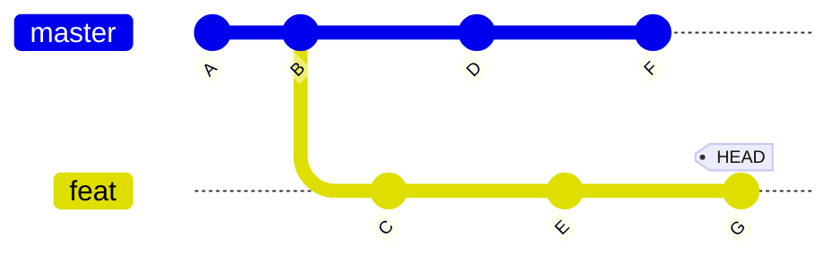
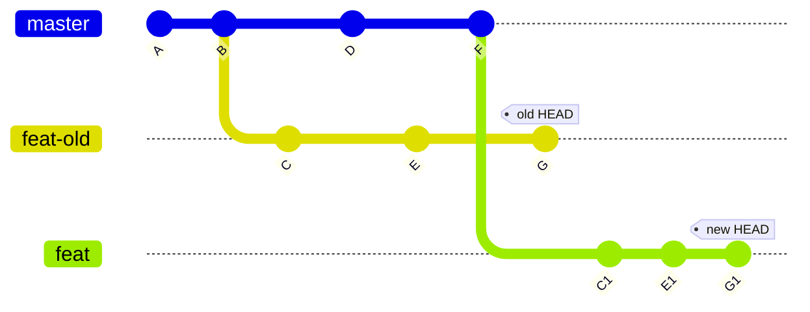

+++
title = 'Git 進階用法：合併分支'
date = 2024-08-28T12:00:00-07:00
draft = false
tags = ["git", "git-zh-hk", "tutorial", "tutorial-zh-hk"]
series = "git-tutorial"
seriesAnnotation = "3/5"
showToc = true
+++

在[上一篇文章](/blog-zh-hk/git-basic-usage-zh-hk)中，我們介紹了 Git
的基礎用法。在本文中，我們將介紹合併分支以及其相關用法。

<!--more-->

*本文章有其他語言的版本：[English（英文）](/blog/git-usage-merging-en)及[简体中文（簡體中文）](/blog-zh-cn/git-usage-merging-zh-cn)。如果你更熟悉這些語言，建議閱讀這些語言的版本。*

在 Git 中，我們時常會使用多個分支來提升工作效率，使工作流程更加靈活。然而，對於初學者來説，理解並使用這些功能並非易事，尤其是合併分支相關的功能。如果你對關鍵命令和概念不夠了解，那麼在處理多個分支時遇到問題時，你可能會不知所措。本文將介紹這些部分的用法，讓讀者更好地理解這些功能。

本文將假設你已經掌握了基礎用法。這些用法在[上一篇文章](/blog-zh-hk/git-basic-usage-zh-hk)中有介紹。具體來說，你應該熟悉[回顧表格](/blog-zh-hk/git-basic-usage-zh-hk#回顧)中列出的內容。

## 合併分支

**關鍵點：始終在自己的分支上進行操作。**

Git 是為分佈式目的而設計的，因此你應該以自己的分支為核心分支。每次你想做一些操作（例如
`merge` 或 `rebase`）時，建議在自己的分支上操作。我們將在 `git rebase` 部分給出更多示例。

Git 提供了兩種合併分支的方法：

- [合併 (merge)](#合併-merge)
- [重定基底 (Rebase)](#重定基底-rebase)

兩種方法各有優劣，而且在工作流程上也有所不同。請根據自己的情況（例如個人偏好、團隊規則等）選擇合適的方法。

在合併分支時，如果雙方修改了同一部分檔案，可能會發生衝突。我們將在本文後面討論如何解決衝突。

### 合併 (Merge)

合併大概有兩種行為：

- **快進合併**。如果 `HEAD` 是要合併的分支的祖先，Git 只會將 `HEAD`
  移動到要合併的分支。你可以使用 `--ff-only`
  選項來強制執行這種行為。下面的圖表描述了快進合併。如果我們在 `master`
  分支上，想要合併 `feat` 分支，那麼 `HEAD` 將移動到 `feat` 分支，也就是從
  `old HEAD` 位置移動到 `new HEAD` 位置。

  ```mermaid
  %%{init: {'gitGraph': {'mainBranchName': 'master'}} }%%
  gitGraph
    commit
    commit tag: "old HEAD"
    branch feat
    commit
    commit tag: "new HEAD"
  ```

- **三方合併**。如果 `HEAD` 不是要合併的分支的祖先，Git
  將創建一個新的提交來合併這兩個分支。下面的圖表描述了三方合併。此時，新的提交有兩個父提交：要合併的分支的最後一個提交和你之前所在的提交。

要合併分支，你可以使用以下命令：

```bash
git merge <commit>...
```

> 例如，如果你在 `master` 分支上，想要合併 `feat` 分支，你可以使用以下命令：
>
> ```bash
> git merge feat
> ```

請注意：

- `<commit>` 參數可以是提交雜湊值或任何提交的引用。
- 要合併的提交數量可以是多個。
- 如果沒有指定提交，Git 將合併當前分支的遠端跟踪分支。
- 使用 `--ff-only` 選項來強制快進合併（例如，`git merge --ff-only feat`）。
- 使用 `--squash` 選項（例如，`git merge --squash feat`）以實現合併但不創建新提交或避免創建合併提交（也就是有多個父提交）。

我們將在後面討論如何解決合併分支時的衝突。

優點：

- 不會影響之前的提交，包括提交者、作者和簽名。

缺點：

- 提交之間的關係複雜，不夠清晰。
- 當合併的分支有大量提交時，衝突解決過程可能會複雜，與重定基底的情況相比。這是因為重定基底過程會逐個應用提交，因此更細粒度。

### 重定基底 (Rebase)

重定基底與合併有所不同。如果提交關係如下圖所示：



然後，將 `master` 分支重定基底到 `feat` 分支後，圖表將如下所示：



`feat` 分支已經重定基底到了 `master` 分支，提交 `C`、`E`、`G` 已經應用到了
`master` 分支的最新提交上。`C1`、`E1`、`G1` 是重定基底操作創建的新提交。本質上，重定基底是將原來的基底從公共祖先變成了要重定基底的分支。

在實際操作中，rebase 操作是將所有受影響的分支（包括從公共祖先到當前分支的所有分支）逐個應用到要重定基底的分支上。這就是為什麼它被稱為重定基底，因為它將當前分支的基底從公共祖先設定為要重定基底的分支。

請注意，你應該是要重定基底的分支的唯一維護者。否則，你可能會遇到很多問題。

要重定基底分支，你可以使用以下命令：

```bash
git rebase <commit>
```

> 例如，如果你在 `feat` 分支上，想要重定基底到 `master` 分支，你可以使用以下命令：
>
> ```bash
> git rebase master
> ```

請注意：

- `<commit>` 參數可以是提交雜湊值或任何提交的引用。
- 如果沒有指定提交，Git 將重定基底當前分支的遠端跟踪分支。
- 如果發生衝突，你應該解決衝突，然後使用 `git rebase --continue` 繼續重定基底操作。我們將在本文後面討論如何解決衝突。

如果你想使用更多功能，你可以使用 `-i` 或 `--interactive` 選項。這將打開一個編輯器，允許你執行以下操作：

- Pick (`p <commit>`): 應用提交。
- Reword (`r <commit>`): 應用並修改提交文字信息。
- Edit (`e <commit>`): 應用提交但不直接自動提交，以便手動修改提交。
- Squash (`s <commit>`): 應用提交但不產生新提交。
- Fixup (`f <commit>`): 類似於 `squash`，但不保留提交信息。
- Execute (`x <command>`): 執行命令（任何的命令行命令）。
- Break (`b`): 在此處停止（使用 `git rebase --continue` 以繼續）。
- Drop (`d <commit>`): 移除提交。
- Label (`l <label>`): 將當前 `HEAD` 打上標籤。
- Reset (`t <label>`): 將當前 `HEAD` 移到某個標籤。
- Merge (`m [-C <commit> | -c <commit>] <label> [# <oneline>]`): 合併提交。
- Update-ref (`u <ref>`): 為引用設立占位符，以將這個引用更新為此處的新提交。

優點：

- 創建的提交被保留為一個鏈，相比之下更清晰易懂。
- 如果要重定基底的提交與當前分支有很大差異，衝突解決會更容易，因為重定基底過程會逐個應用提交。

缺點：

- 如果要重定基底的提交的提交者不是執行重定基底操作的人，那麼這些提交將失去原始提交者（以及簽名）。
- 如果有兩個或兩個以上的人在同一個分支上工作，那麼分支可能不會是最新的，這意味著你必須手動遴選提交（如果你是分支的唯一維護者，你不會遇到這個問題）。
- 可能會發生更多的衝突，但這種情況很少見。

### 解決衝突

> [!TIP]
> 只要需要合併，衝突一定有可能發生。

<!-- markdownlint-disable-line MD028 -->
> [!CAUTION]
> 當衝突發生時，請先解決衝突，然後再做其他事情。如果你發現很難先解決衝突，請放棄合併操作。否則，你會使情況變得更加混亂，更難解決。

在合併分支時，Git 會告訴你是否自動合併失敗。如果自動合併失敗，你必須手動解決衝突。

你可以使用 `git status` 命令檢視合併的狀態。在有衝突的檔案中，你會看到類似以下消息：

```plaintext
<<<<<<< HEAD
...
||||||| b6279c7
...
=======
...
>>>>>>> feat
```

第一個 `...` 是當前 `HEAD` 的內容；第二個 `...` 是共同祖先的內容；第三個 `...`
是要合併的內容。

你也可以使用其他工具（例如 [delta 項目][delta-project]）以更直觀的方式來檢視衝突，我們將在接下來的文章中介紹如何配置和使用。

[delta-project]: https://github.com/dandavison/delta

如果你使用 rebase，解決衝突會更容易，因為每個提交的變化更細粒度，有明確的意圖（變更是逐個提交應用的）。

當衝突（包括其他操作出現的衝突，如 stash 操作，我們會在之後介紹 stash 操作）發生時，git
會將其余没有衝突的檔案添加到暫存區，并將衝突的檔案留在工作目錄中。你應該儘早解決衝突，然後將解決后的檔案添加到暫存區。之後，你應該根據你的合併策略使用以下命令：

- 對於合併策略，創建一個新的提交（例如，`git commit`）。
- 對於重定基底策略，繼續重定基底操作（例如，`git rebase --continue`）。

還有一些其他「小技巧」：

- 「走為上計」：`git merge --abort`、`git rebase --skip`、`git rebase --abort`（取決於你使用的策略）。
- 「言聽計從」：`git merge -s theirs ...`。
- 「固執己見」：`git merge -s ours ...`。

### 常見工作流程示例

假設主分支是 `master`，功能分支是 `feat`。我們需要將 `feat` 分支合併到 `master`
分支，但 `master` 分支無法快進合併 `feat` 分支。

- 合併策略：在 `master` 分支上合併 `feat` 分支。

  推薦這樣做之後再切換到 `feat` 分支，並以快進合併的方式將 `master`
  分支合併。這將使 `feat` 分支與 `master` 分支保持一致。如果你不這樣做，短期內不會有什麼問題，但隨著變更的積累，衝突或其他問題（例如，沒有衝突但不能正確運行）將更有可能發生。
- 重定基底策略：在 `feat` 分支上重定基底 `master` 分支，然後切換到 `master`
  分支，並以快進合併的方式將 `feat` 分支合併。

## 相對引用

當你在多個分支上工作時，相較於使用雜湊值，提交的相對關係更有意義。有時，用某個提交的相對關係來表達另一個提交會更加方便且明確（如
`HEAD` 的父提交）。

因此，Git 提供了一種相對引用的表達方式（比如，`HEAD^` 表示父提交，`HEAD~2`
表示 `HEAD` 的父提交的父提交）。規則如下：

- `<rev>~<n>`：`<rev>` 的第 `n` 代祖先提交。例如：
  - `HEAD~0`：等價於 `HEAD`。
  - `HEAD~1`：`HEAD` 的父提交。
  - `HEAD~n`：`HEAD` 的第 `n` 代祖先提交。
- `<rev>^<n>`：在多個父提交的情況下切換（`git merge`
  產生的提交有多個父提交）。注意：`^` 單獨表示「父提交」，`n`
  用於在一個或多個父提交中切換（如果超出父提交的數量，將會出現錯誤）。`n`
  表示 `<rev>` 的第 `n` 個父提交。例如，`HEAD^`（等價於 `HEAD^1`）和 `HEAD^2`。

> [!WARNING]
> `^` 和 `~` 可能是你的 shell 的特殊字符，所以如果是特殊字符，你應該轉義它們。
>
> 1. 在 bash 中，它們不是特殊字符，所以你不需要轉義它們。
> 2. 在 zsh 中，`^` 是特殊字符，所以你應該使用 `\` 轉義它，或者使用單引號來避免觸發
>    shell 內建的轉換（例如，`HEAD\^` 或 `'HEAD^'`）。

## 暫時儲藏 (Stash)

有時，你需要切換到另一個分支，但又沒有打算提交當前分支的更改。在這種情況下，如果直接切換到另一個分支，Git
可能會因為當前分支的更改（這種情況只會在當前分支和另一個分支的檔案不同的情況下發生）而拒絕切換。

因此，Git 允許你暫時地儲藏更改，以便稍後隨時使用。具體來說，Git
有一個修改堆疊，記錄了所有暫時儲藏的更改。你可以使用以下命令使用此功能：

1. 儲藏更改：

   ```bash
   git stash
   ```

2. 恢復更改：（你可能需要解決衝突，使用 `git status` 檢視更多信息）

   ```bash
   git stash pop
   ```

   如果出現關於衝突的提示，你應該盡快解決衝突，並將解決後的檔案添加到暫存區。在這種情況下，git
   不會像沒有衝突時那樣自動刪除儲藏。因此，你應該使用 `git stash drop`
   命令手動刪除儲藏。

3. 列出儲藏的更改：

   ```bash
   git stash list
   ```

4. 清除所有儲藏的更改：

   ```bash
    git stash clear
    ```

5. 丟棄最近儲藏的更改：

   ```bash
   git stash drop
   ```

## 獲取共同祖先

在某些情況下，你可能需要獲取多個分支（通常是兩個）的共同祖先。你可以使用以下命令獲取共同祖先：

```bash
git merge-base --all <commit>...
```

> 例如，如果你想獲取 `master` 和 `feat` 分支的共同祖先，你可以使用以下命令：
>
> ```bash
> git merge-base --all master feat
> ```

## 從提交中恢復檔案到工作目錄

如果你誤刪了已提交的檔案或目錄，你可以使用以下命令將其恢復到工作目錄：

```bash
git restore <path>...
```

請注意，這個操作會丟棄所有已更改的檔案，因此可能會有風險。為了更安全地實現類似的功能，你也可以[暫時儲藏更改](#暫時儲藏-stash)。

> 例如，如果你誤刪了 `README.txt` 檔案，你可以使用以下命令將其恢復：
>
> ```bash
> git restore README.txt
> ```

如果你想恢復的檔案源不是 `HEAD`，你可以使用 `--source=<tree>` 選項指定。`<tree>` 可以是提交雜湊值或任何提交的引用。例如，如果你想從 `HEAD` 的父提交中恢復 `README.txt` 檔案，你可以使用以下命令：

```bash
git restore --source=HEAD~ README.txt
```

如果你的 Git 版本不支援 `git restore` 命令，你可以使用 `git checkout` 命令代替。用法與 `git restore` 命令類似：

```bash
git checkout <path>...
```

> 例如，如果你在前面的例子中誤刪了 `README.txt` 檔案，你可以使用以下命令：
>
> ```bash
> git checkout README.txt
> ```

## 取消暫存

如果你誤將檔案添加到暫存區，你可以使用以下命令取消暫存：

```bash
git restore --staged <path>...
```

> 例如，如果你誤將 `README.txt` 檔案添加到暫存區，你可以使用以下命令取消暫存：
>
> ```bash
> git restore --staged README.txt
> ```

如果你的 Git 版本不支援 `git restore` 命令，你可以使用 `git reset` 命令代替：

```bash
git reset HEAD <path>...
```

> 例如，如果你在前面的例子中誤將 `README.txt` 檔案添加到暫存區，你可以使用以下命令：
>
> ```bash
> git reset HEAD README.txt
> ```

## 清理工作目錄

如果你發現你的工作目錄中有很多未跟踪的檔案，你可以使用以下命令清理它們：

```bash
git clean -i
```

`-i` 選項表示「交互」，這意味著它會提示你是否刪除未跟踪的檔案。使用 `-i`
選項時，你也可以指定想要刪除的檔案。如果你不想使用交互模式，或者你需要在腳本中使用這個命令，你應該去掉這個選項。此外，你可以使用
`-f` 選項強制刪除。

## 重置分支的 HEAD 提交

有時，我們可能需要將某個分支的 HEAD 提交更改為另一個提交（例如，當前 HEAD 的父提交）。

如果你不在你想要更改的分支上，請先切換到該分支。然後，你可以使用以下命令實現：

```bash
git reset [--soft | --mixed | --hard | --merge | --keep] <commit>
```

根據 [git reset 文檔](https://git-scm.com/docs/git-reset)所說，`--soft`、`--mixed`、`--hard`、`--merge`
和 `--keep` 選項的含義如下：

- `--soft`：不會對暫存的檔案或工作目錄進行任何更改（但是會將 HEAD 重置為
  `<commit>`，就像所有模式一樣）。這將使所有更改的檔案變為待提交檔案。
- `--mixed`（默認）：重置暫存區但不重置工作目錄（即更改的檔案會被保留，但不會標記為提交），並報告未更新的檔案。
- `--hard`：重置暫存區和工作目錄。自 `<commit>` 以來對工作目錄中已跟踪檔案的任何更改都將被丟棄。任何在寫入任何已跟踪檔案的路徑上的未跟踪檔案或目錄都將被直接刪除。
- `--merge`：重置暫存區並更新工作目錄中 `<commit>` 和 `HEAD`
  之間不同的檔案，但保留暫存區和工作目錄之間不同的檔案（即具有未添加的更改的檔案）。如果
  `<commit>` 和暫存區之間的檔案之間有不同的檔案具有未提交的更改，操作將被中止。
- `--keep`：重置暫存區的內容並更新工作目錄中 `<commit>` 和 `HEAD`
  之間不同的檔案，並將其餘的檔案（包括暫存的和未暫存的）當作未暫存[^1]。如果
  `<commit>` 和 `HEAD` 之間的檔案之間有未提交的更改，重置將被中止。

[^1]: 原文中沒有直接提及所有其他檔案（包括暫存或未暫存的）都被視為未暫存。這部分是為了使解釋更清晰而添加的。

> 例如，如果你想將 `master` 分支的 HEAD 提交更改為其父提交，並重置索引和工作目錄，你可以使用以下命令：
>
> ```bash
> git reset --hard HEAD~
> ```

## 檢視差異

在 Git 中，有四種常見的檢視差異的情況：

- [檢視工作目錄和某些提交之間的差異](#檢視工作目錄和某些提交之間的差異)
- [檢視暫存區和某些提交之間的差異](#檢視暫存區和某些提交之間的差異)
- [檢視提交之間的差異](#檢視提交之間的差異)
- [生成修補檔](#生成修補檔)

### 檢視工作目錄和某些提交之間的差異

使用以下命令檢視工作目錄和某些提交之間的差異：

```bash
git diff <commit>
```

> 例如，如果你想檢視工作目錄和 `feat` 分支之間的差異，你可以使用以下命令：
>
> ```bash
> git diff feat
> ```

特別地，如果你想檢視工作目錄和當前 `HEAD` 之間的差異，你可以直接運行：

```bash
git diff
```

要檢視某些檔案或目錄的差異，你可以指定它們：

```bash
git diff <commit> <path>...
```

> 例如，如果你想檢視 `README.txt` 檔案的工作目錄和 `feat`
> 分支之間的差異，你可以使用以下命令：
>
> ```bash
> git diff feat README.txt
> ```

### 檢視暫存區和某些提交之間的差異

使用以下命令檢視暫存區和某些提交之間的差異（與前面的情況類似，只需添加 `--cached` 選項）：

```bash
git diff --cached <commit>
```

與前面的情況類似，你可以省略 `<commit>` 參數以檢視暫存區和當前
`HEAD` 之間的差異。你也可以指定檔案或目錄以檢視差異。

### 檢視提交之間的差異

使用以下命令檢視兩個提交之間的差異：

```bash
git diff <commit> <commit>
```

> 例如，如果你想檢視 `master` 和 `feat` 分支之間的差異，你可以使用以下命令：
>
> ```bash
> git diff master feat
> ```

與前面的情況類似，你可以指定檔案或目錄以檢視差異：

```bash
git diff <commit> <commit> <path>...
```

### 生成修補檔

要為任何差異生成修補檔，你只需要將前面的情況的輸出重定向到一個檔案。

> 例如，如果你想為當前工作目錄和 `HEAD` 之間的差異生成一個修補檔檔案 `patch.diff`，你可以使用以下命令：
>
> ```bash
> git diff > patch.diff
> ```

在下一部分中，我們將介紹如何應用修補檔。

## 應用修補檔

要應用修補檔，你可以運行：

```bash
git apply <patch>
```

> 例如，如果你想應用 `patch` 目錄中的 `patch.diff` 修補檔，你可以使用以下命令：
>
> ```bash
> git apply patch/patch.diff
> ```

## 檢視提交

要檢視提交的詳細信息，你可以使用以下命令：

```bash
git show <commit>
```

> 例如，如果你想檢視當前 `HEAD` 的父提交的詳細信息，你可以使用以下命令：
>
> ```bash
> git show HEAD~
> ```

## 回退提交

如果我們在某些提交中做了錯誤的更改（例如，在解決一個 bug 時引入了另一個更嚴重的
bug），我們可以回退這些提交。你可以使用以下命令回退提交：

```bash
git revert <commit>...
```

這將逐個回退每個提交。請注意，每個回退的提交都會創建一個新的提交。如果你不想創建多個提交，你可以使用
`--no-commit` 或 `-n` 選項。

> 例如，如果你想回退 `614b994` 和 `d4be492` 兩個提交，你可以使用以下命令：
>
> ```bash
> git revert 614b994 d4be492
> ```
>
> 這將創建兩個新的提交。

## 遴选 (Cherry-pick) 提交

有時，我們可能需要將其他分支的提交應用到當前分支。例如，我們有一個開發分支和一個用於生產的主分支。開發分支可能有一些修復關鍵
bug 的提交，我們希望將它們應用到主分支。在這種情況下，我們希望將這些更改應用到主分支。

Git 提供了 `cherry-pick` 命令來將提交應用到當前分支。要遴选提交，你可以使用以下命令：

```bash
git cherry-pick <commit>...
```

此操作將逐個應用提交。與 `revert` 命令類似，每個遴选的提交都會創建一個新的提交。如果你不想創建多個提交，你可以使用
`--no-commit` 或 `-n` 選項。

> 例如，如果你想遴选 `614b994` 和 `d4be492` 兩個提交，你可以使用以下命令：
>
> ```bash
> git cherry-pick 614b994 d4be492
> ```
>
> 這將創建兩個新的提交。

## 在檔案中查找特定內容

如果你想在檔案中查找特定內容（例如，一個字符串），你可以使用以下命令：

```bash
git grep <pattern> <path>...
```

如果你沒有指定 `<path>`，Git 將在整個倉庫中搜索。`pattern` 與 `grep` 命令中的模式類似。

> [!TIP]
> 此命令有其他替代方案（例如 [rip-grep][ripgrep]），我們將在接下來的文章中介紹。

[ripgrep]: https://github.com/BurntSushi/ripgrep

## 檢視引用日志

在基本使用文章中，我們提到如果提交了更改，那麼更改可以很容易地被檢索。這是因為 Git
有一個引用日志，記錄了所有關於提交的更改。你可以使用引用日志檢視與提交相關的所有操作。要檢視引用日志，你可以運行：

```bash
git reflog
```

## 管理遠端倉庫

在基本使用文章中，我們介紹了如何添加遠端倉庫。在這裡，我們將介紹更多的命令來管理遠端倉庫。

### 列出遠端倉庫

要列出所有遠端倉庫，你可以使用以下命令：

```bash
git remote show
```

使用 `--verbose` 或 `-v` 選項檢視更多細節：

```bash
git remote -v show
```

要列出特定的遠端倉庫，你可以運行：

```bash
git remote show <repo>
```

> 例如，如果你想檢視 `origin` 倉庫的詳細信息，你可以使用以下命令：
>
> ```bash
> git remote show origin
> ```

### 添加新的遠端倉庫

這已經在基本使用文章中介紹過了。使用以下命令添加新的遠端倉庫：

```bash
git remote add <name> <url>
```

### 移除遠端倉庫

要移除遠端倉庫，你可以使用以下命令：

```bash
git remote remove <name>
```

> 例如，如果你想移除 `origin` 遠端倉庫，你可以使用以下命令：
>
> ```bash
> git remote remove origin
> ```

### 修改遠端倉庫地址

要修改遠端倉庫地址，你可以使用以下命令：

```bash
git remote set-url <name> <url>
```

> 例如，如果你想將 `origin` 遠端倉庫修改為 `git@github.com:github/gitignore.git`，你可以執行以下命令：
>
> ```bash
> git remote set-url origin git@github.com:github/gitignore.git
> ```

### 重命名遠端倉庫

要重命名遠端倉庫，你可以使用以下命令：

```bash
git remote rename <old-name> <new-name>
```

## 回顧

現在，讓我們回顧一下本文和前一篇文章中介紹的用法。

| 命令 | 描述 | 備註 |
| --- | --- | --- |
| `git init` | 初始化一個新倉庫 | 當前目錄不能是一個已存在的倉庫 |
| `git clone <url>` | 複製一個已存在的倉庫 | 目標目錄不能存在 |
| `git add <path>` | 將 `<path>` 中的更改添加到暫存區 | 提交只會應用於添加到暫存區的檔案 |
| `git status` | 檢查倉庫的狀態 | 推薦在提交前使用 |
| `git diff` | 檢視差異 | 使用 `--cached` 檢視暫存區的差異；可以指定路徑 |
| `git commit` | 進行一次提交 | 如果消息很短，使用 `-m`；經常提交（檔案的更改在大多數情況下很容易找回） |
| `git log` | 檢視提交歷史 | 使用 `--oneline` 讓每個提交僅佔用一行；使用 `--graph` 檢視提交圖 |
| `git remote add origin <url>` | 添加一個遠端倉庫 | 遠端倉庫的默認名稱是 `origin`；你可能需要遵循第一次推送時的指示（例如，`git push --set-upstream origin master`） |
| `git remote show` | 列出遠端倉庫 | 使用 `-v` 檢視更多細節；你可以透過名稱指定倉庫 |
| `git remote set-url origin <url>` | 修改遠端倉庫地址 | |
| `git remote remove origin` | 移除遠端倉庫 | |
| `git remote rename origin new-origin` | 重命名遠端倉庫 | |
| `git push` | 將更改推送到遠端倉庫 | 如果快進合併策略失敗，使用 `--force` 強制推送（這會丟棄一些提交） |
| `git fetch` | 從遠端倉庫抓取更改 | 如果你想抓取非默認分支，使用 `git fetch <repo>` |
| `git pull` | 從遠端倉庫抓取並合併更改 | 默認的合併策略可能不同 |
| `.gitignore` | 忽略檔案 | 使用 `.gitignore` 忽略你不想提交的檔案 |
| `git branch <branch>` | 添加一個新分支 | 新分支名稱不能存在；另一種解決方案：`git checkout -b <branch>` |
| `git switch <branch>` | 切換到另一個分支 | 對於其他引用，請加上 `--detach`；另一種解決方案：`git checkout <branch>` |
| `git merge <branch>` | 合併分支 | 使用 `--ff-only` 強制快進合併；使用 `--squash` 合併但不創建新提交或避免創建合併提交 |
| `git rebase <branch>` | 重定基底分支 | 使用 `-i` 或 `--interactive` 使用更多功能 |
| `<rev>~<n>` | 獲取 `<rev>` 的第 `n` 代祖先提交 | |
| `<rev>^<n>` | 獲取 `<rev>` 的第 `n` 個父提交 | `^` 單獨表示「父提交」 |
| `git stash` | 暫時儲藏更改 | 使用 `pop`、`clear` 和 `list` 檢索、清除所有、列出儲藏的更改 |
| `git merge-base --all <commit>...` | 獲取共同祖先 | |
| `git restore <path>` | 從提交中恢復檔案到工作目錄 | 使用 `--source=<tree>` 指定源；另一種解決方案：`git checkout <path>` |
| `git restore --staged <path>` | 取消暫存 | 另一種解決方案：`git reset HEAD <path>` |
| `git clean` | 清理工作目錄 | 使用 `-i` 交互模式；使用 `-f` 強制刪除 |
| `git reset <commit>` | 更改分支的 HEAD 提交 | 選項：`--soft`、`--mixed`、`--hard`、`--merge` 或 `--keep` |
| `git apply <patch>` | 應用修補檔 | |
| `git show <commit>` | 檢視提交 | |
| `git revert <commit>...` | 回退提交 | 使用 `--no-commit` 或 `-n` 避免創建多個提交 |
| `git cherry-pick <commit>...` | 遴選提交 | 使用 `--no-commit` 或 `-n` 避免創建多個提交 |
| `git grep <pattern> <path>...` | 在檔案中查找特定內容 | 如果未指定路徑，將在整個倉庫中搜索 |
| `git reflog` | 檢視引用日志 | |

## 總結

在本文中，我們介紹了 Git 的高級用法，重點介紹了與合併分支相關的命令。希望透過這篇文章，你可以熟練掌握管理多個分支的技巧。我們將在下一篇文章中介紹子模塊的用法。

## 版權

你可以將本文用於任何目的，只要你在使用的地方明確標註原作者和連結
(<https://lau.yeeyu.org/blog-zh-hk/git-usage-merging-zh-hk>)。請忽略頁腳處的版權聲明。
