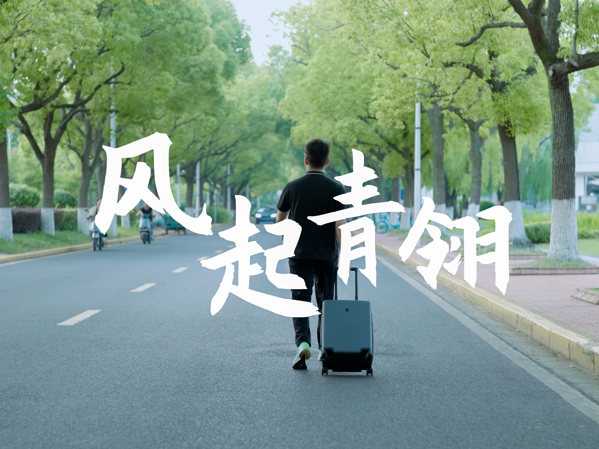
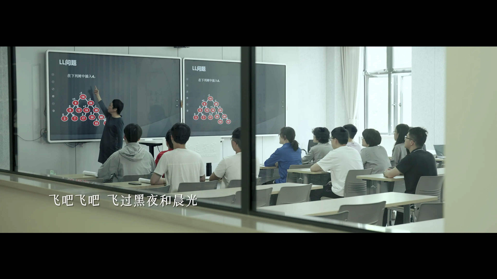
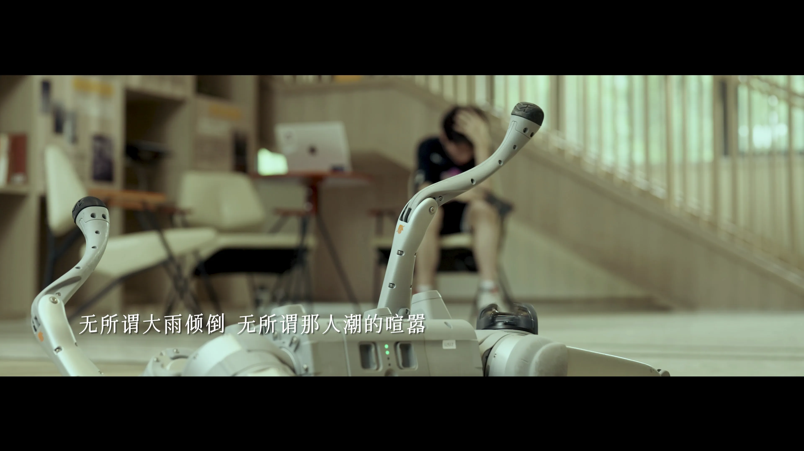
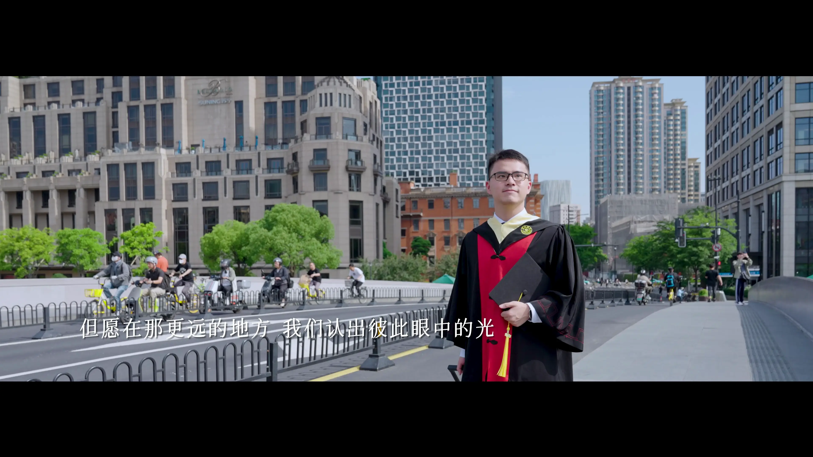
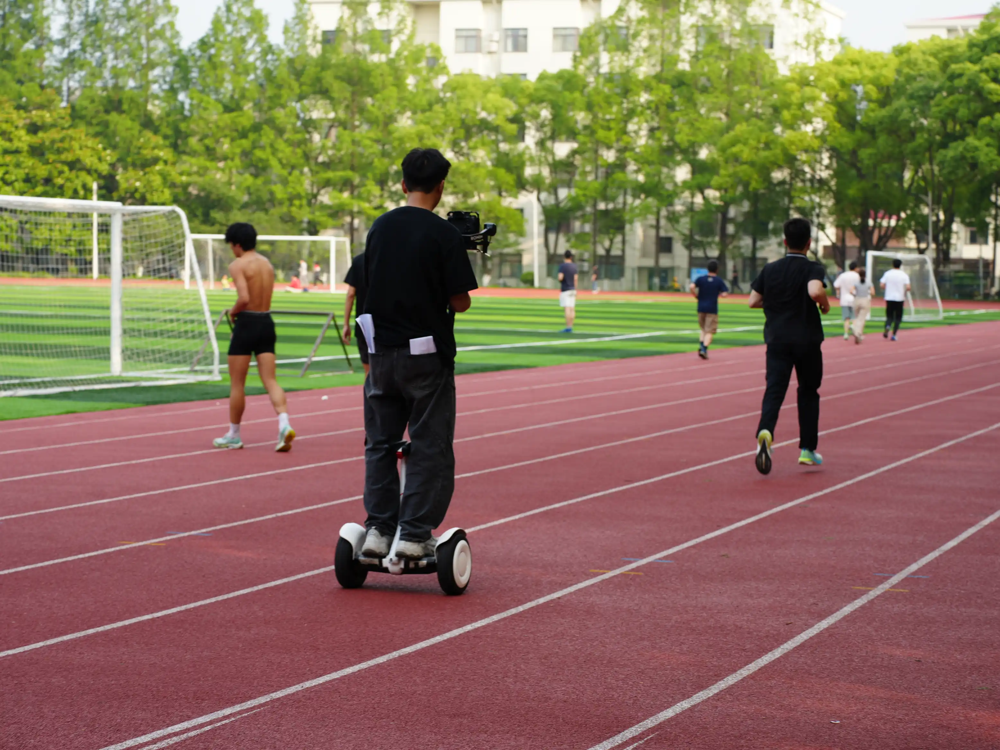

+++
title = 'Behind the Scenes: Undergraduate Graduation Music Video, Feathers in the Wind'
date = 2025-06-06T15:00:00+08:00
lastmod = 2025-08-02T21:00:00+08:00
draft = false
tag = ['music-video', 'graduation']
categories = ['art']
+++

In mid to late February, I was invited to take charge of the music video
project for my college. After several months's working, including planning,
filming, and post-production, we finally completed this [graduation MV][mv-link] just in
time for the graduating ceremony on 24 June, 2025. Here, I'd like to share
some behind-the-scenes stories and express my heartfelt thanks to everyone
who contributed to this project.

[mv-link]: https://www.bilibili.com/video/BV15TKGzZE9R/

<!--more-->

The video is produced in simplified Chinese and do not have any translation
to other languages unfortunately. Translating the lyrics to other languages
is extremely difficult to keep the original meaning and rhyme, so no plan
of translating the lyrics will be made.

If you are familiar with Chinese, you should read the
[Chinese version of this post][simplified-chinese-version].

[simplified-chinese-version]: /blog-zh-cn/behind-the-scenes-feathers-in-the-wind/

## The Story

The film is told from the perspective of a student on the verge of graduation,
confused and uncertain about the future.
As the protagonist passes by an classroom building, he stops and walks inside,
with memories of the past four years popping to his memory.
Entering a classroom, he is transported back to those familiar lessons.
Moments of lectures, presentations, group dinners, activities, and coursework
flash before him as though they had just happened.
This marks the beginning of the first interlude, featuring a momentum of motion
to symbolise change of character.

In the second section, the protagonist's role evolves---from a knowledge
recipient to a teaching assistant and researcher.
The film cuts to various laboratory scenes, representing different academic
topics, each engaging in its own form of research.
What unites them all is a shared dedication and passion.
This chapter ends with a robot standing upright successfully,
symbolising growth and transformation.

This is followed by another interlude in which the protagonist recalls
taking photos with graduating dressing, evoking feelings of joy and excitement.
He rushes back to his dormitory---thus beginning the third act---changes
into his academic dress, and revisits several lab scenes.
His previous confusion is now replaced by anticipation and hope for the future.

Finally, the protagonist walks out of the university with suitcase in tow,
heading into the wider world, ready to face new challenges ahead.

### Representation of Multiple Disciplines

Our film's protagonist represents students from all academic directions and
topics.
Due to the unique structure of Zhiyuan College at Shanghai Jiao Tong University,
we have eight distinct academic tracks, each with their own methodologies.
Including one protagonist per track would have made the narrative fragmented.
To address this, we opted for a single protagonist, with different students
appearing in various scenes to represent the different directions and topics
(hence the protagonist himself never appears in those lab-specific shots
for each directions).

Until all these scenes have been shown, the protagonist’s full face is
intentionally hidden to avoid forming premature associations.
Only after the academic dress scene is his face revealed---providing emotional
closure and emphasis.

## Production Summary

I served as the director and one of the producers for the video, responsible
for song selection, visual design, and scene planning.

Upon receiving the task in February, I immediately began song planning.
I would express special thanks to BIAN Weiyang (卞卫阳) and
LIANG Yalun (梁亚伦), who were critical in composing and producing the original
music. Without their contribution, this project would not have been possible.

By late March, when the song's basic skeleton was finalised, I began designing the MV.
The emotional arc was mapped out, then broken into story segments.
These outlines were refined in collaboration with the people in charge of the music.

Once the story outlines and segment durations were set, I designed the corresponding scenes.
To reflect the four-year journey, I split the memory segments into two:
one focusing on classroom life and another on the growth into a teaching assistant and researcher.
Before the first instrumental break, we depicted lectures, coursework, and social life.
Afterward, lab work, teaching, and research were highlighted as signs of maturation.

In fact, I struggled with the concept for the third segment.
Fortunately, inspiration from other MVs led me to feature a change into academic dress and a lab revisit.
This not only heightened the emotional tone but also reinforced the core message and connected smoothly with the film's ending.

By the time the story structure was finalised in May, most students were busy with theses and defences,
and couldn't help plan scenes.
Thankfully, our student affairs advisor, QIAO Xinyi (乔馨仪), stepped in and helped coordinate students from each track.
Her contributions were essential during pre-production, ensuring progress remained steady.

Our filming days were scheduled during the 3rd through 5th, June.
Beforehand, I had completed the shot list and communicated extensively
with each student that would appear in our video, ensuring availability.
I also coordinated with the filming crew to ensure smooth operations.
As it was my first time producing, the pressure was considerable.
I had to make sure each scene was filmed on schedule and every potential delay didn't affect overall arrangement.

Thanks to the buffer time in our plan, filming proceeded without a hitch.
It was a highly rewarding experience as both producer and director.
Once filming wrapped, I finally breathed a sigh of relief.
I'd like to thank all students who participated---your support was key to this MV's success.
Also, special thanks to Guo Junxian (郭俊贤), our lead actor, who worked tirelessly
and handled each take with dedication, bringing our vision to life.

Post-production proved more challenging than expected.
After returning from a trip to Dalian, I reviewed the initial cut and realised numerous edits were required.
The pacing lacked variation, weakening the emotional effect, and the colour grading didn’t match my expectations.
After multiple rounds of revisions (including one afternoon spent editing onsite),
we finally locked the final version just before the ceremony.
LIANG Yalun also mentioned similar issues during audio producing.
These problems are understandable---it's hard for editors to fully grasp
our thoughts---but through communication, most issues were resolved.

## Fun Facts

### Celebrating Post-Project Completion

At the end of the first segment, there's a scene where a student celebrate
finishing a major assignment.
Initially, the paper-flying effect looked underwhelming,
so a crew member joined me (I played that role) in tossing papers from a nearby bed.
That's how we achieved the current look.

### Running Scene

During the first instrumental break, there's a running scene where the
protagonist jogged for more than one laps---fitness and filming, all in one go.

### CAI Xingzhi's Singing Shot

At 03:15, the third act opens with a singing scene by CAI Xingzhi (蔡行之).
This shot is intentionally placed right after the protagonist walks quickly,
leaving viewers space for guessing his destination.
It's only after the singing ends that we realise he's heading back to his
dormitory to change into academic dress.

Some singing shots serve more than just musical purpose---they often
provide natural transitions between story parts. This is one of the examples.

### Zhapu Road Bridge Scene

The final scene takes place on Zhapu Road Bridge.
We woke at 5:30 am for this (though lead actor GUO Junxian missed the
alarm---I had to call to wake him), left the dorm around 6, and reached
the bridge by 7.

The bridge presented many filming challenges: unpredictable traffic,
and a steep drop between the pavement and the bike lane.
We spent nearly 50 minutes filming, capturing obout 30 takes.
Our actor now surely knows what it means to "one more take" and "last take".

## Acknowledgements

Last but not least, I would like to extend my deepest thanks to all
people who contributed to this MV.
We dreamed alone, but together we achieved![^1]
Thank you for your collaboration and support.
I sincerely wish every graduate of the Class of 2025 the very best
in all their future endeavours---may you move boldly forward
and sail smoothly ahead! All the best!

[^1]: This is a quote by Formula One driver Lewis Hamilton, who said "We
      dreamed alone, but together we believed" to his race enginner Bono
      just before leaving Mercedes in 2024.
