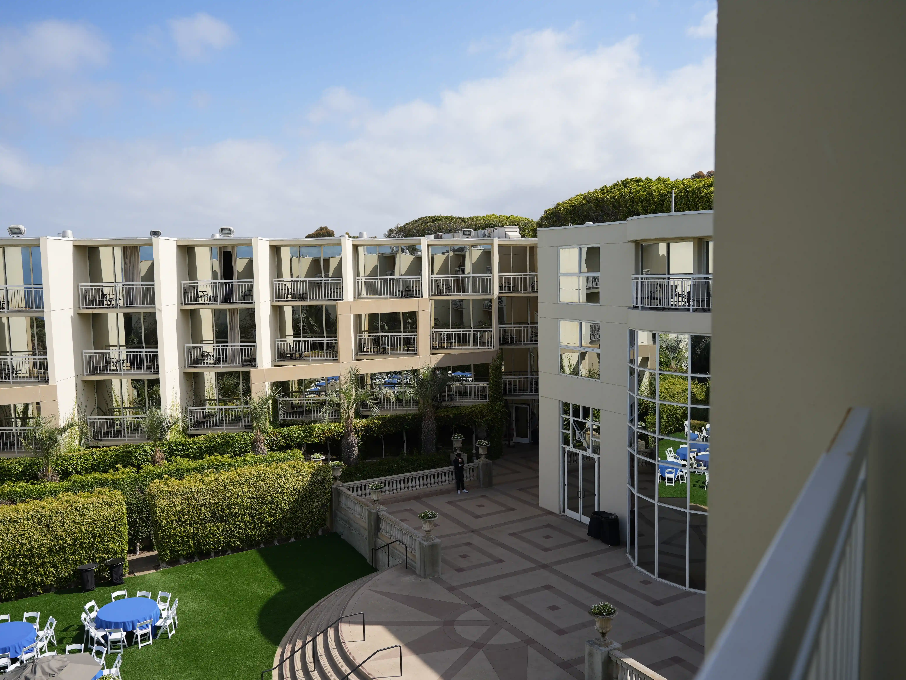
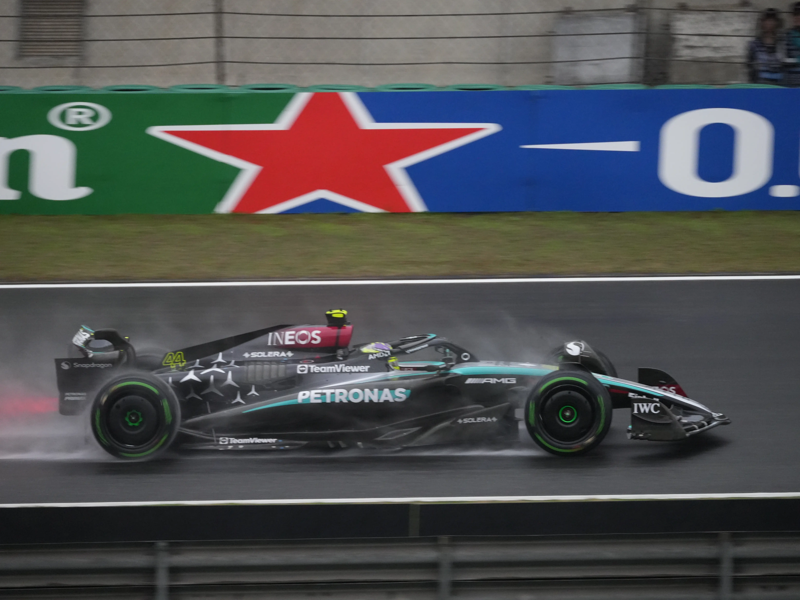
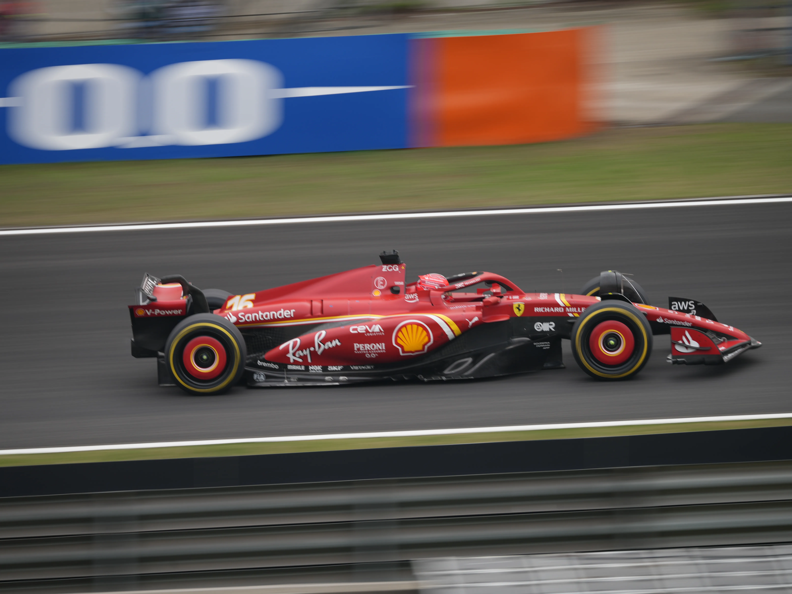
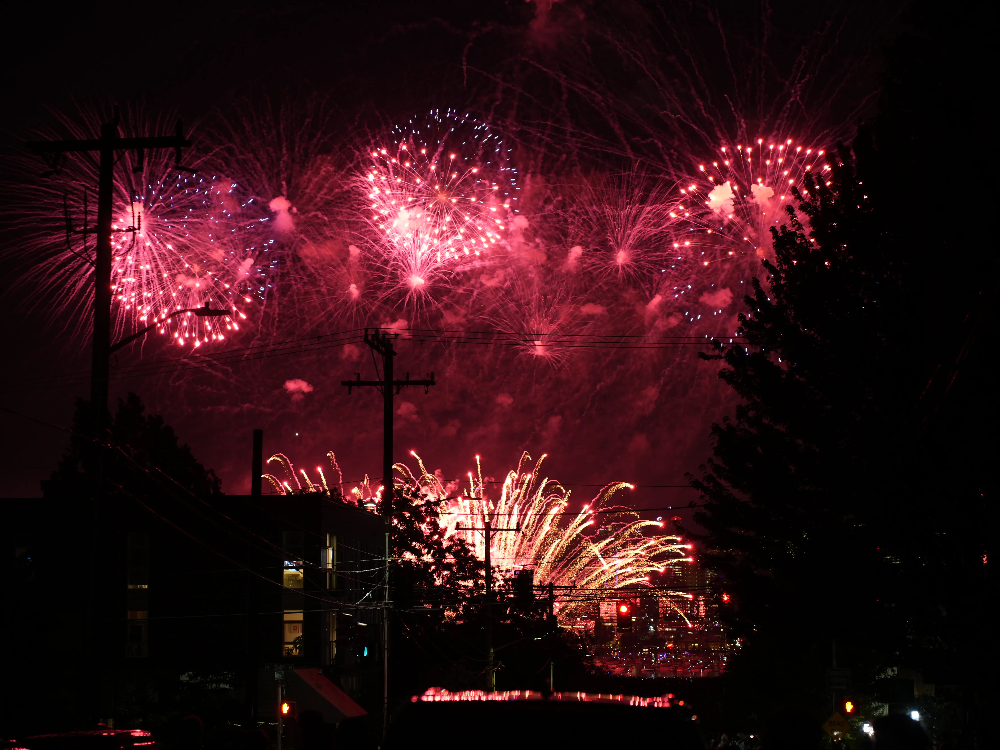
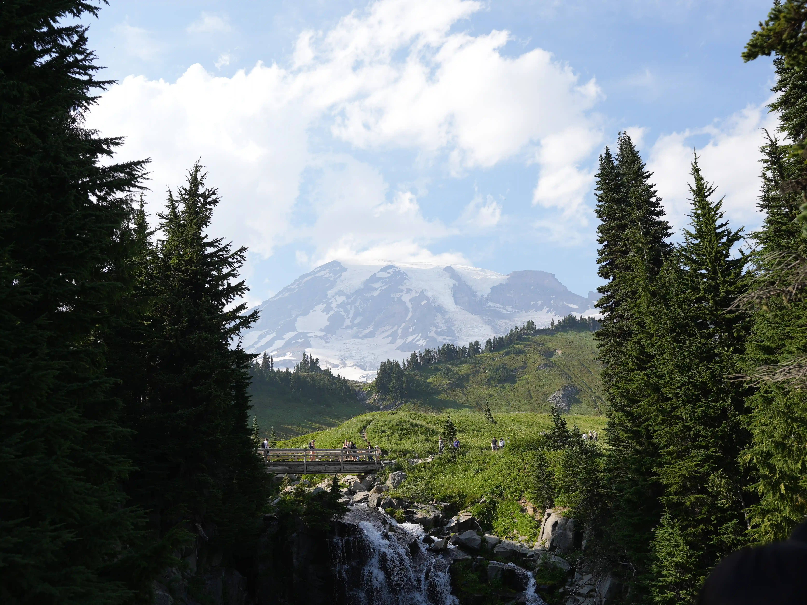
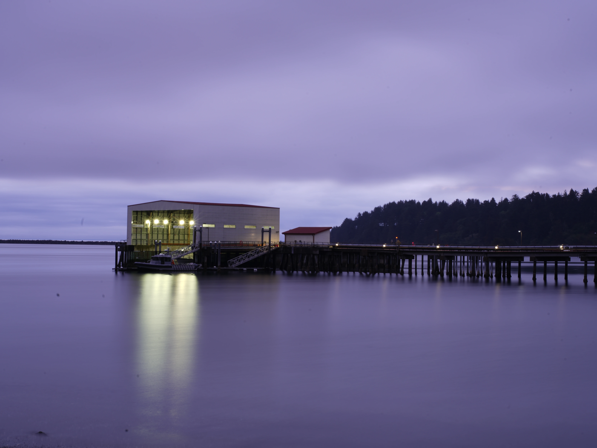
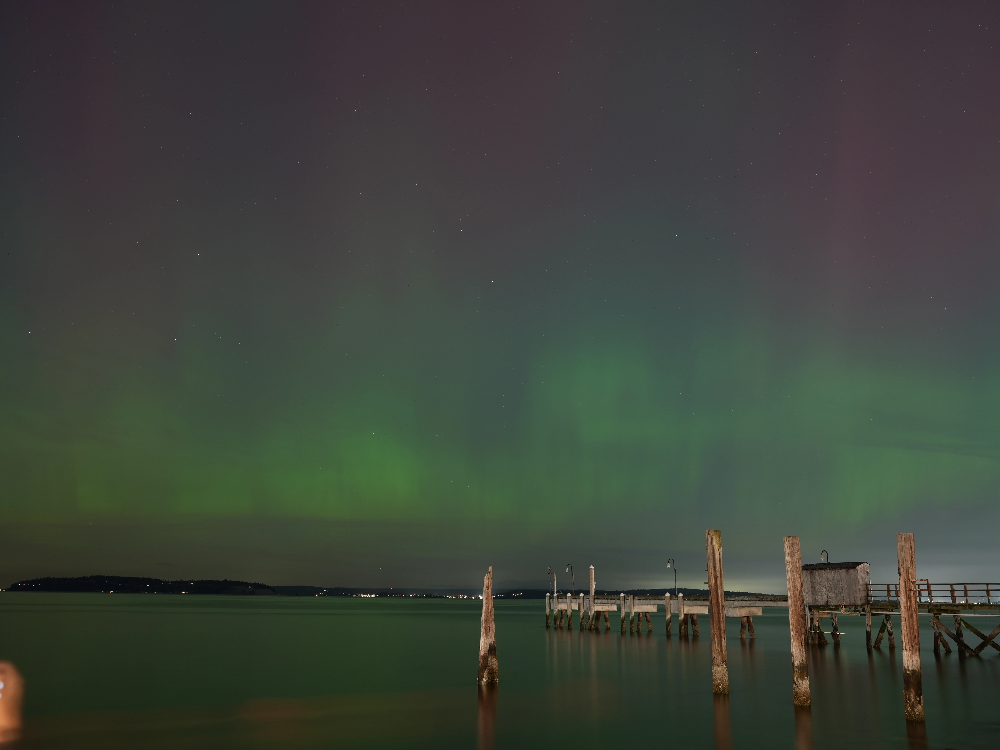
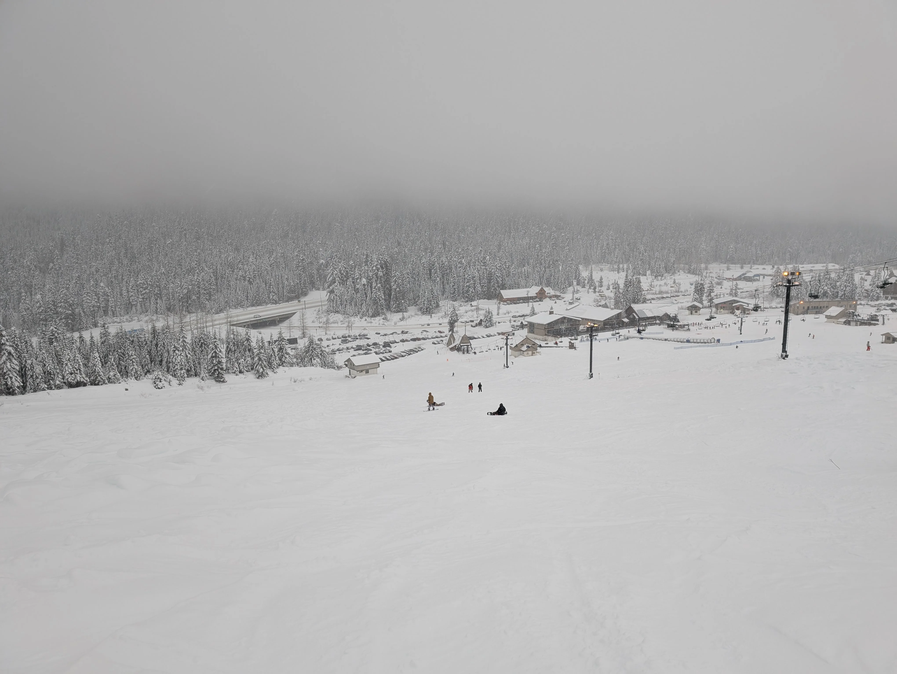

+++
title = 'Farewell, 2024!'
date = 2024-12-31T22:00:00+08:00
modified = 2025-01-16T22:00:00+08:00
draft = false
categories = ['personal']
tags = ['farewell', '2024']
+++

There are a lot of things happened in 2024. I have been through a lot of
challenges and difficulties, but I have also made a lot of progress. 2024
is a year that changed me a lot.

<!--more-->

## First Paper Published

In 2024, I published my first paper. It was a great experience for me.

The paper[^1] was about about using memory pool to improve the memory
efficiency of serverless computing. I can still clearly remember the morning
when I saw an email on my phone, saying that my paper was accepted. It was
such a special moment that I will never forget.

[^1]: FaaSMem: Improving Memory Efficiency of Serverless Computing with Memory
      Pool Architecture <https://dl.acm.org/doi/10.1145/3620666.3651355>

In April and May, I attend the conference where my paper was presented.
The conference was held in a beautiful place, La Jolla, California. It was
the first time I went to the United States, and I was so excited to
experience the culture there.

During the conference, I met a lot of great people. I talked with them
quite a lot, and I learned a lot from them. The conference was an ideal
place to learn about the topics that people are working on.

## Formula 1 Live for the First Time

In 2024, I watched the Chinese Grand Prix live for the first time. From
the TV, the speed will look slower because of the nature of telescope
lens. But when you watch it live, you will feel the speed of the cars and
also smell the petrol and rubber.

The spirit qualifying session was the most exciting part. When I saw the
rain flag came out from my camera, the excitement was beyond words. Lando,
Lewis and Fernando made decent laps against all odds in the rain, and beat
the Red Bull despite significant disadvantage in performance.

The spirit was interesting-half and boring-half. When Lewis got the leader
position, hope appeared in my heart. But the Red Bull was too fast to defend.
The race was actually ended in the middle.

The qualifying and race sessions are also not very interesting. The Red
Bull was too fast.

## Internship at University of Washington

The internship at University of Washington was a unforgettable experience
for me. The people there are very nice, and we went for a lot of trips
together around Seattle. Moreover, I learned a lot from this internship.

### The First Project during Internship

The first project is to build a system that improves the utilization of
persistent memory with disaggregated architecture. To improve performance,
most of the communication is handled through asynchronous operations, which
actually made it really hard to debug.

After investigating the end-to-end latency, we decide to remove a component
in the critical path and merge its functions to the other component. It sounds
easy to make that change, since all code can be reused. However, concurrent
issues popped up all the time and cost Rohan and me several months to debug.

From this project, I realised the huge amount of effort in a large scale
systems. A small change in the code might influence the whole system,
especially when the change affects the lock stuff (directly or indirectly).

### The Second Project during Internship

When we submitted the first project, it was already late October. Chien-Yu Lin
asked if I can offer some help on another project. He introduced the project
to me in details, and guide me through the codebase.

We together evaluated the performance, and address issues raised during the
evaluation. Ideas came out from both of us during the discussion, trying to
squeeze the last bit of speedup from the system.

The last few day ahead of the deadline was intense. We were trying to present
a good story in the paper, but it was by no means easy. Dependencies existed
between subsections, so arranging the order of writing was crucial. As a
result, we were still writing the paper a few minutes before the deadline.

At the same time of the submission, there were a lot of deadlines for my PhD
application. This posed a huge challenge on my scheduler. Which to prioritise
was alway a tough question.

The project taught me a lot, including how to collaborate with multiple people
of different ideas, how to organise the story, and how to resolve different
deadlines simultaneously.

### Gym

The experience at UW brought me to the gym. I started to do some strength
training, play badminton and swim, and I found it really interesting. I can
feel the progress I made every time I went to the gym. Going to the gym
with friend is a good way to relax and reduce anxiety.

### The Fourth of July

The fireworks on the Fourth of July was also unforgettable to me. People
celebrated the Independence Day with fireworks so that liberty rooted deeply
in everyone's heart. When the fireworks were launched to the sky over Seattle,
everyone was cheering. What a beautiful scene with flowers of fire blossoming
over the land of the free and the home of the brave!

### Trip around Seattle

#### Mount Rainier

The Mount Rainier is so special to the Washington state. My labmates and I
went to hike on the Mount Rainier. The paradise trail was so beautiful, and
the view was so amazing. Although there were not much snow on the mountain,
the scene was still breathtaking.

#### Olympic National Park

I also went to the Olympic National Park with my labmates. The time there
was so chill, and the view was so beautiful. We drove three hour to the
beach for the sunset, only to find it was cloudy. But I took a photo that
is even better than that, with the tune of fantasy.

On the last day of the trip, we went a rainforest and a beach. The view
of both places was breathtaking. I felt so relaxed.

### Aurora

2024 was also an aurora year. I saw the aurora for the first time in my life.

On 7th of October, I saw the aurora from my apartment roof. The aurora was not
very strong, but still fantastic to me.

All the effort of hunting for the aurora was paid off on 10th of October. On
that day, my labmates and I drove to the Mukilteo Lighthouse Park near
Everett. From the park, we can see the aurora above the ocean. The photo
taken from my camera was beyond words.

### Ski

This is the first time I went to ski. I went to the Summit at Snoqualmie with
my labmates. Thanks to Dedong's guidance, I learned how to ski in a day.
I can clearly remember when I was stranded in the snow, my labmates came to
rescue me and help me to re-wear the ski. Here, I extend my gratitude to them.

### Dark Clouds

Besides the good things during my internship at UW, there were also some
dark clouds. It is not a secret that there are cases of sexual harassment.
I was shocked when I heard that there existed such cases in the lab. Our
lab activities, including the lab lunch, were ceased. The number of people
presented in the lab reduced significantly, which makes it difficult to
learn more about others' work through daily chats. Several learning lunches
regarding the problem was organised. From these lunches, I improved
my understanding of treating people with respect and learned about the
culture difference. Despite the efforts done by everyone in the lab,
the final report of this incident was not released until the end of the
year. I hope this problem can be properly resolved and provide a safe
place for everyone in the lab.

Apart from that, I also realised that there are also a lot of problem in
academia. Bullying and discrimination are not rare. Unfair treatment,
usually based on inequality in relationships with conflict of interest, is
also common yet hard to be addressed. These problems are partly because the
punishment is too severe, and do not have range of punishments according
to the severity of the problem. I hope the academia can be a better place
for everyone.

## Conclusion

2024 is a year that affected me a lot. So many unique experiences happened
in this year. I learned how to be a better researcher, how to be a better
collaborator, and how to be a better person. During this year, I became
more independent, more confident, and more open-minded. I am looking forward
to take new challenges in 2025!
