+++
title = 'Farewell, 2025!'
date = 2025-12-31T01:00:00-08:00
draft = false
categories = ['personal']
tags = ['farewell', '2025']
+++

Looking back, 2025 was truly unforgettable. Through all the highs and lows,
I've grown in ways I never expected. Despite so many difficulties I
encountered, I'm ending the year grateful for the new friends I've made,
the places I've travelled, and the person I'm becoming.

<!--more-->

*Note: All photos in this post are taken by me and copyrighted.*

## The Academic Transition

In December 2024, I submitted a few PhD applications. As a result, I started
to be interviewed and subsequently to receive offers from January 2025.
However, the journey was not smooth. Multiple challenges emerged along the way.

### The First Challenge: Funding Issues

As the interview process going on, people started to report funding cuts from
federal agencies. This arose concerns on the availability of funding for PhD
students. The University of Washington, for example, used a waitlist for
PhD admissions for the first time in decades. I received two offers (Harvard
and Boston University) in January, but only received one waitlist
from University of Washington in February (later became a rejection in April).
It was a big mental blow to me, as the difference between these two months
was significant. In March, I received another two offers (University of
Pennsylvania and New York University).

### The Second Challenge: Making a Decision

Making the final decision is by no means easy, as you have to weigh
pros and cons that are hard to quantify. Each university has its own style,
culture, and strengths. After receiving all the offers, I spent a lot of time
chatting with advisors who recruited me and current students of these
advisors.

Finally, after careful consideration for several weeks, I decided to go
to Harvard University, which is the first offer I received. The Open House
event in Feburuary at Harvard was impressive and convinced me that Harvard
is the best fit for me given the situation. While I took Harvard as my
final choice, I was still grateful for the other offers and the opportunities
they provided.

### The Third Challenge: SEVP Craziness

After my decision, I started to prepare for the visa application process.
However, on the 22nd of May, the Department of Homeland Security (DHS) sent
a letter to Harvard University, announcing that the certificate of
the Student and Exchange Visitor Program (SEVP) had been revoked.[^1]
The Harvard University took almost immediate action to support international
students and filed a complaint to get back our rights.[^2]

[^1]: The DHS letter regarding SEVP revocation: https://www.harvard.edu/research-funding/wp-content/uploads/sites/16/2025/05/S1-Ltr-to-Harvard-05222025_Redacted.pdf.
[^2]: The response from the Harvard Internation Office: https://www.hio.harvard.edu/news/our-commitment-enrolling-international-students-and-scholars.

Interestingly, on the day before the DHS letter, my visa was issued.
It was a great relief for me, though the SEVP revocation may still
impact my ability to enroll in Harvard. The craziness has been temporarily
settled with a court order and will hold until the lawsuit is resolved.[^3]
Several other orders have also been issued by the Department of Homeland
Security to affect international students, but for now, fortunately, does
not make big impact on international students at Harvard.

[^3]: The update from Harvard International Office: https://www.hio.harvard.edu/news/update-court-issues-preliminary-injunction-against-revocation-harvard%E2%80%99s-sevp-certification.

### Graduation

This is not a challenge, but it is a milestone: graduating from Shanghai Jiao
Tong University with a Bachelor's degree. This marks a pivotal transition in
my academic career---closing the chapter on my undergraduate studies and
beginning my journey as a PhD student. Looking back, I am amazed at how
quickly the past four years flew by and how much knowledge I gained along
the way.

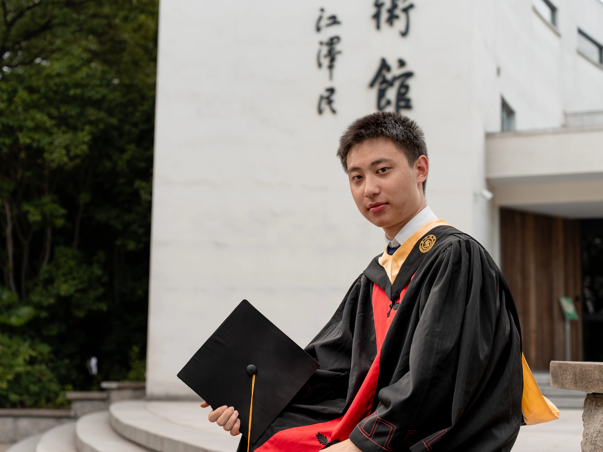

### The Fourth Challenge: Getting Used to the New Environment

After sorting out all the difficulties, I finally arrived to Harvard
University. The campus is beautiful, and the people are friendly.
However, adapting to a new environment is always challenging.
The academic culture, lab environment, and even the weather are different
from what I'm used to.

The courses at Harvard are more rigorous than my expectations, and the
workload is heavy. The instructors are knowledgeable and passionate, but
they also expect a lot from students. I have to manage my time effectively
to manage coursework, research, and personal life.

The weather there is another great challenge for me. Boston is dry, cold,
and windy in winter. Coming from a humid climate, I did not expect to feel
so uncomfortable. Hopefully, I will get used to it over time.

### The Challenge over the Year: Paper Rejections

The 2025 is crazy in terms of paper submissions and rejections. I made 5 paper
submissions (including co-authored papers) this year, and unfortunately, all
of them got rejected. It was not the results that made me frustrated, but the
mixture of hard work and bad rewards that made me feel powerless. I'm not a
person who will yield to difficulties easily, but the powerlessness did make me
feel down for a while.

## Travels

Despite the academic challenges, I enjoyed traveling to several places in 2025.
These trips left me with unforgettable memories and fantastic experiences.
I will share some highlight photos as well.

### Trip to Boston and Seattle

As part of the campus visits, I travelled to Boston and Seattle in early 2025.
In Boston, I attended the Open House event at Harvard University, where I
met with faculty members, current students, and other prospective students.
The people there were welcoming and supportive, bringing me a relaxed
and enjoyable vibe.

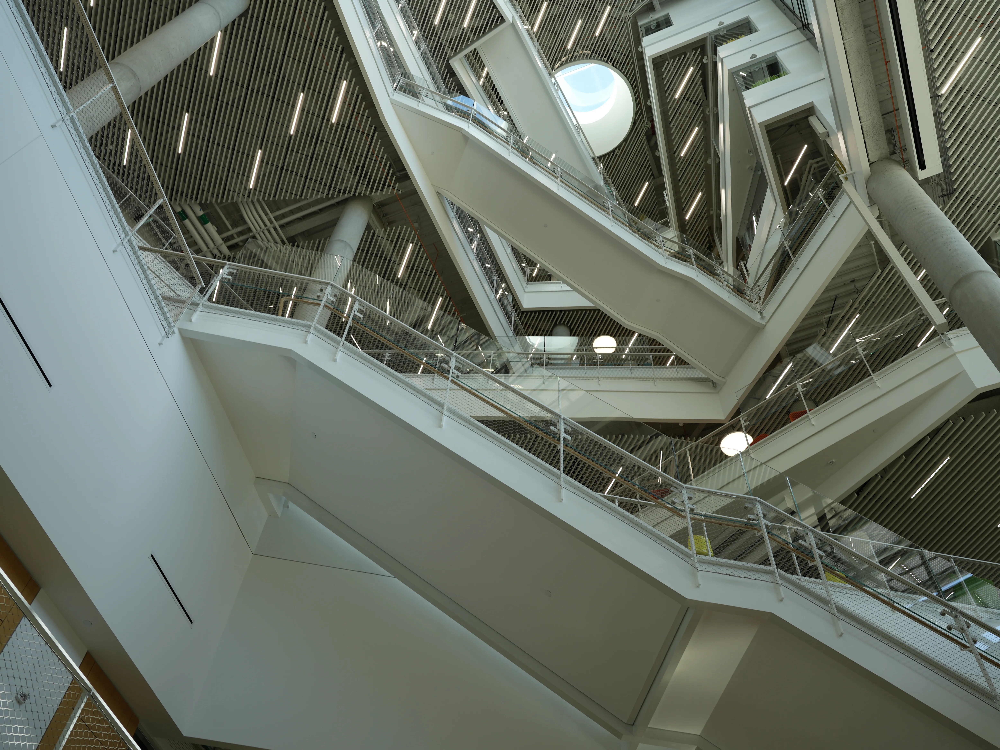

The Boston city itself is vibrant and diverse, with a rich history and culture.
The freedom trail gave me a glimpse of the country's revolutionary past, while
the museums and galleries showcased the city's artistic side.

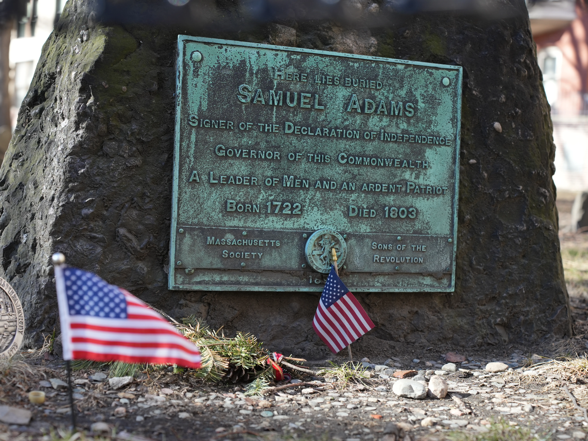

I also visited Seattle, to meet my friends there. I felt so lucky to see
the beautiful Mount Rainier again.

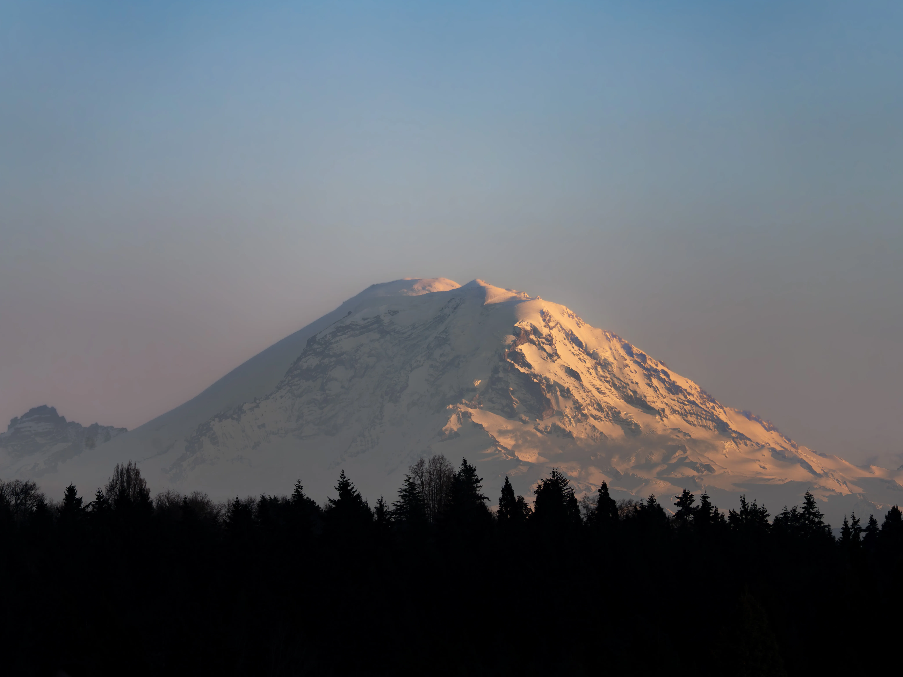

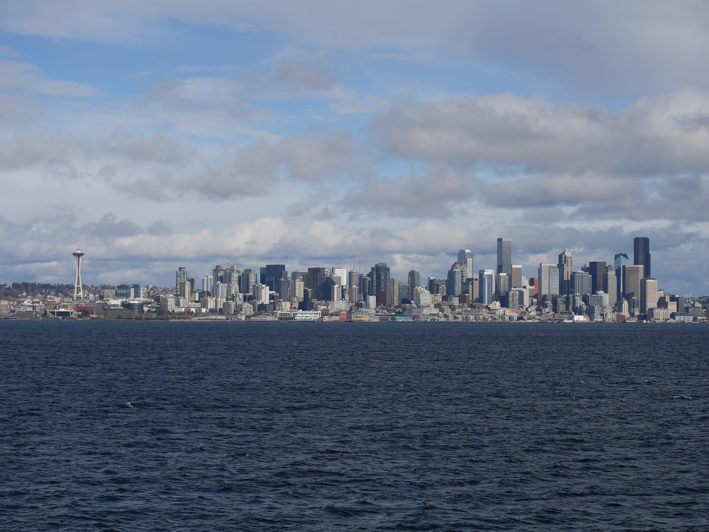

During my stay in Seattle, there is also a blood moon lunar eclipse, which I
managed to capture.

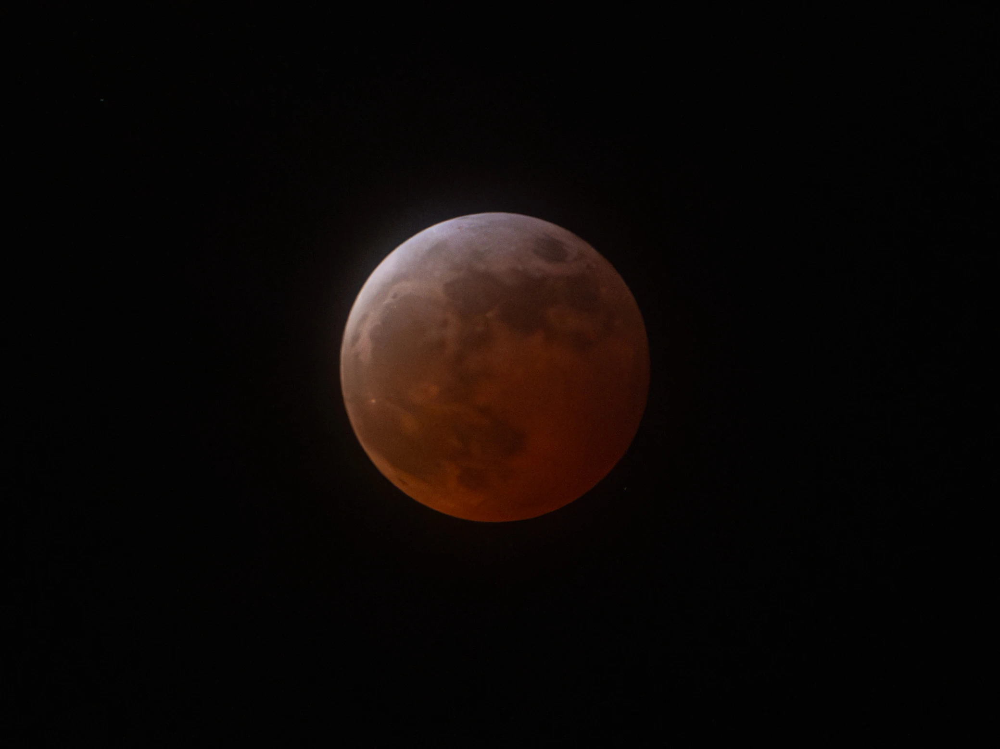

### Trip to Hangzhou

I also travelled with my classmates to Hangzhou, China in April. The West Lake
and the mountains around it were beautiful, and the spring weather made the
trip even more enjoyable. We hiked on the Shililangdang (十里鋃鐺) trail,
which offered a village view that is hard to see in the city.

 Trail")

### Trip to Changsha

In April, I also went to Changsha with my family. We visited several
attractions, including the Yuelu Academy, Orange Island. The vibe
of the city was lively and energetic, with a mix of modern and traditional
elements. We also tried some local food. The food is great, though it seems
to be too spicy for me.

 at Night")

### Trip to Dalian

Dalian is a beautiful coastal city in Northeast China.
I visited there with a friend in June 2025.
The beaches and seafood were amazing, and we really enjoyed ourselves.
Since I had just finished the shooting of the graduate music video,
the trip was exactly the relaxing break I needed.

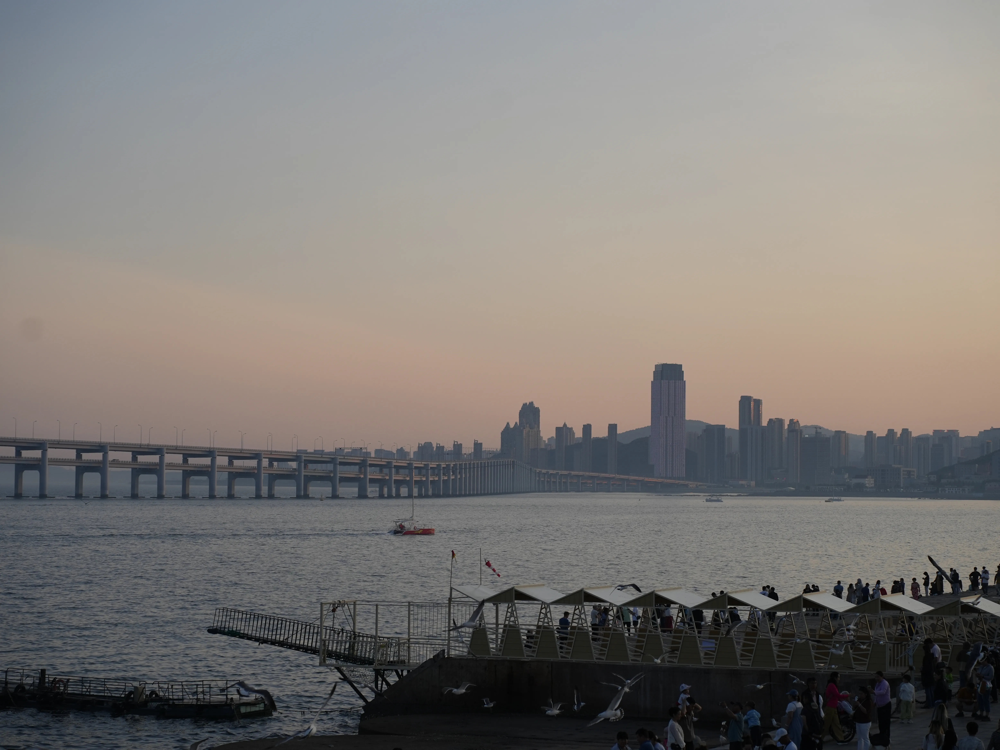

### Trip to Yunnan

In July 2025, I travelled to Yunnan Province, China with my friends.
We visited several places, including Lijiang, Dali and Kunming.
The natural scenery was breathtaking, and the local culture was fascinating.
The lakes, mountains, and ancient towns made the trip unforgettable.
I really enjoyed the time with my friends, exploring new places and
experiencing new things together.

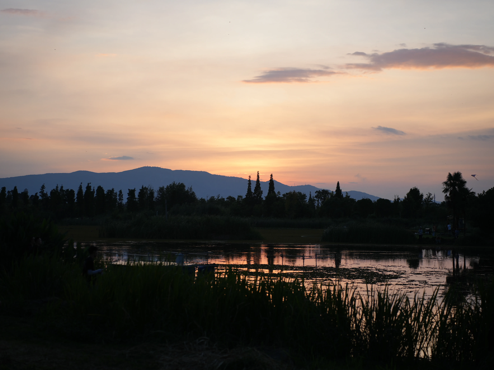

### Trip to Maui, Hawaii

In Demeber 2025, I travelled to Maui, Hawaii with my friends in Seattle.
The tropical island offered a perfect getaway from the cold winter in Boston.
The wet and warm climate was refreshing, and the beaches were stunning.
We snorkeled in the clear waters, drived along the scenic Road to Hana,
visited the red sand beach, and hiked in the Haleakalā National Park.
The time there was so relaxing and enjoyable, and served as a great
end to this busy and challenging year.

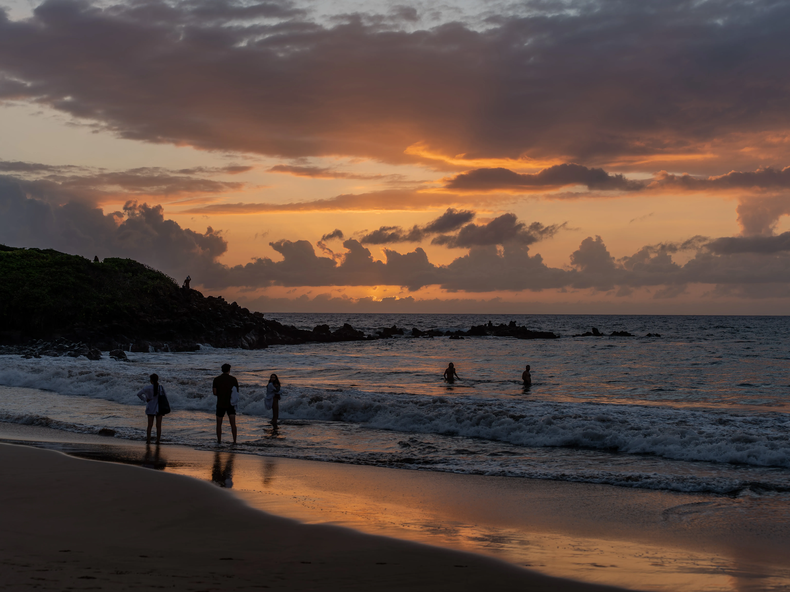

*Check out more photos in the post on my photography website here:
[Baked with Aloha](https://i.amwhatiam.org/posts/baked-with-aloha/).*

## Graduate Music Video

The graduate music video for the Class of 2025, Zhiyuan College, Shanghai
Jiao Tong University, was a big project I led in 2025. The preparation
started from March 2025, and the release was in June 2025.
The video features the college life of different majors in Zhiyuan College,
and tells the story of how student grow and find their passions towards
the future. For more details, please check out the post I wrote about it:
[Behind the Scenes: Undergraduate Graduation Music Video, Feathers in the Wind](../behind-the-scenes-feathers-in-the-wind/).

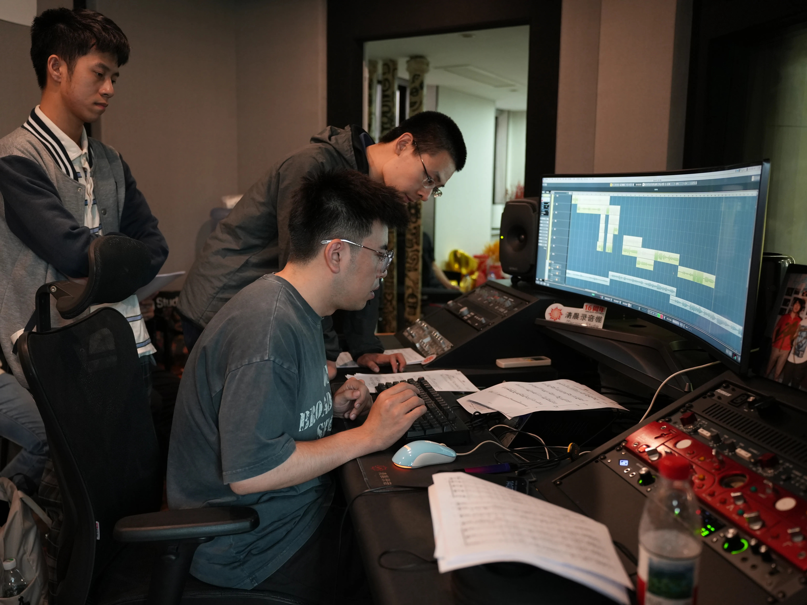

## Other Photos of the Year

Other than the travel photos mentioned above, I also took some photos
during the year that I would like to share.

### Formula 1 Chinese Grand Prix

I watched the Formula 1 Chinese Grand Prix in Shanghai in April 2025. This
was the second time I watched a Grand Prix in person, and the Saturday
was particularly surprising to me, as Lewis Hamilton won the sprint race.
Lewis Hamilton made a stunning performance, keeping the pace while protecting
his tyres in a unbelievable way. I was so excited to see him getting
the victory in person.

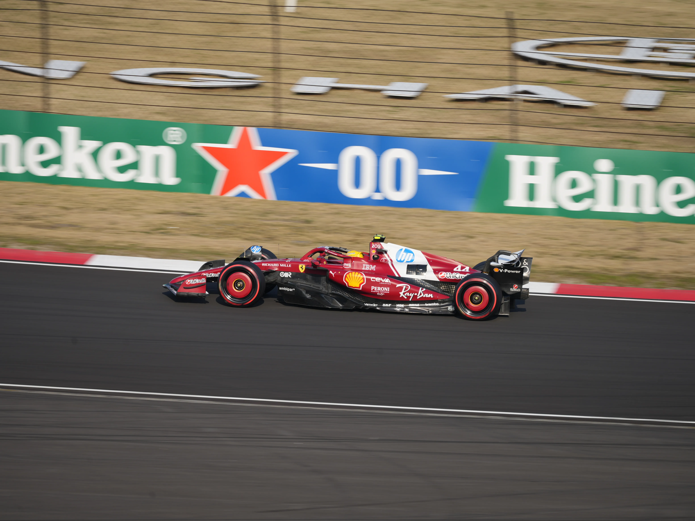

The race day was not very great---both Ferrari drivers were disqualified
due to technical infringements. And the bad luck was already with Lewis
ever since.

### Aircraft Spotting

This year, I also started to do aircraft spotting as a new hobby.
I took photos at several spots, including Boston Logan International Airport
(BOS/KBOS), Seattle-Tacoma International Airport (SEA/KSEA),
Everett Paine Field Airport (PAE/KPAE),
Salt Lake City International Airport (SLC/KSLC),
and Kahuilui Airport (OGG/PHOG) in Maui, Hawaii.

The Mount Rainier is a iconic landmark of the Washington State, and it
makes a perfect backdrop for aircraft spotting at Seattle-Tacoma International
Airport. I was lucky to capture this Delta Air Lines aircraft with the
mountain in the background.
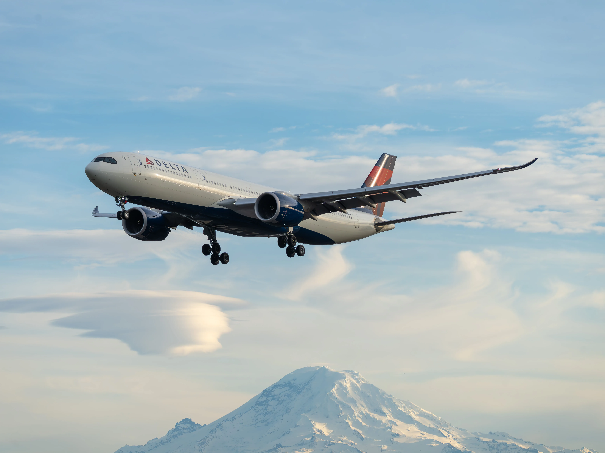

The 2026 is the centennial year of Lufthansa, the German flag carrier.
To celebrate this milestone, Lufthansa painted a Boeing 787-9 in a special
livery that pays tribute to the airline's history from 1926 to 2026.
I was so lucky to capture the delivery flight of this special aircraft
at Paine Field Airport in Everett, WA, USA.
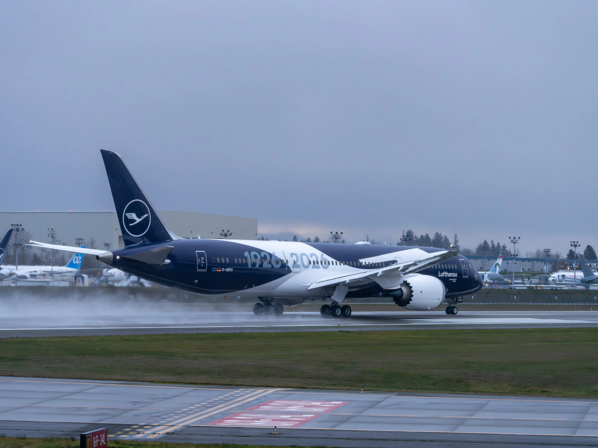

The sunset time at Boston Logan International Airport is always beautiful.
On the other hand, the Lfuthansa Airbus A340-600 fleet is going to be retired
soon. This made the photo of the golden aircraft even more special to me.
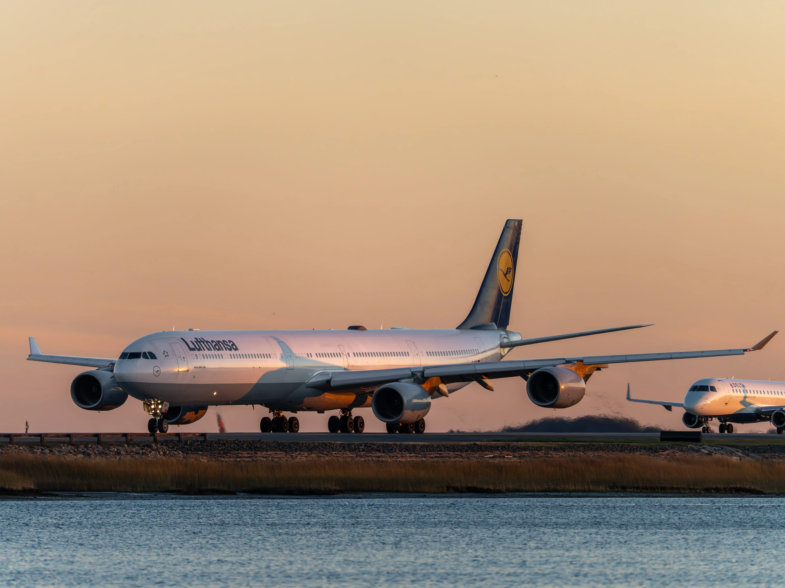

### Photos Taken in Boston and Cambridge

The Widener Library at Harvard University is an iconic building on campus.
The architecture is grand and majestic, and the interior is filled with
history. I took this photo inside the library.
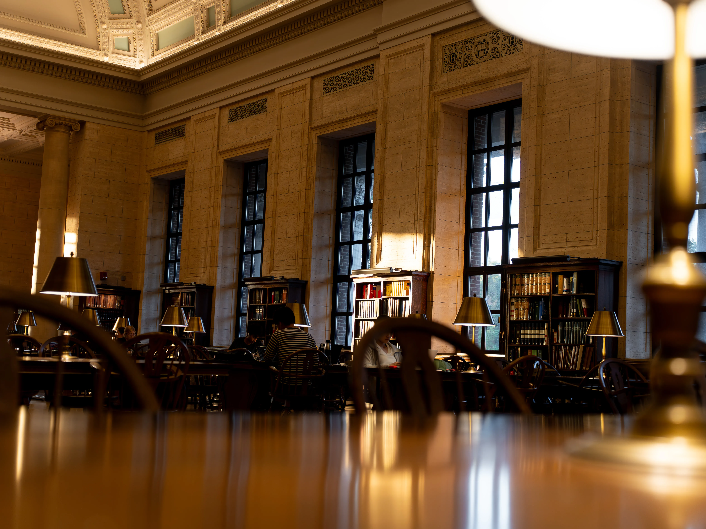

In Mid-autumn Festival 2025, I took this photo with the building
of Harvard University and the round moon.
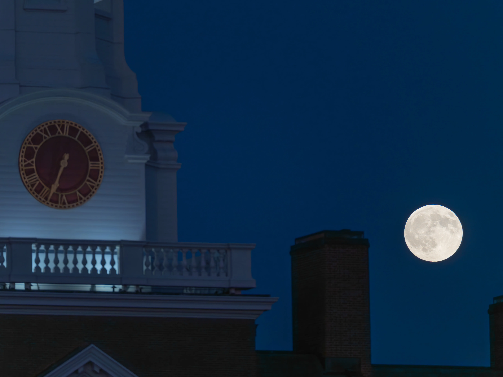

I also watched a football game between Harvard University
and Cornell University on 10 October 2025. The atmosphere
was exciting, and I enjoyed the time with my friends.

On 11 November 2025, I took this photo of northern lights over the
Charles River. The aurora was not very bright, but it was still
a rare sight in Boston. The bright line on the top right was
from an airplane passing by.
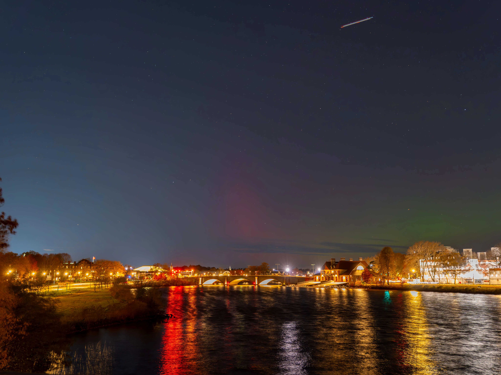

## Conclusion

2025 was not my year, yet I strove to make it memorable.
I learned a great deal from every obstacle I encountered.
To those I have loved, and those who have loved me:
may you have a beautiful 2026!
Happy New Year!

