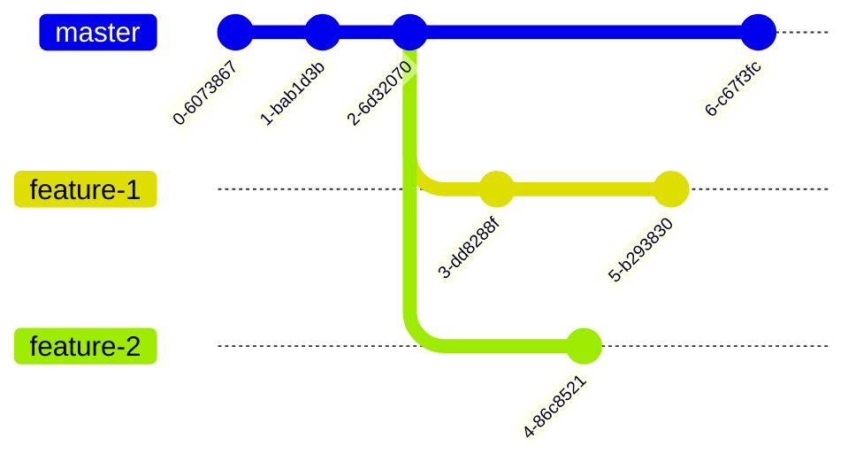

+++
title = 'Git Basics - How was Git Designed?'
date = 2024-07-15T12:00:00-07:00
draft = false
tags = ["git", "git-en", "tutorial", "tutorial-en"]
series = "Git 1/5"
showToc = true
+++

In this article, we will discuss about the version control system and how
Git was designed.

<!--more-->

*This article has other versions in different languages:
[简体中文 (Simplified Chinese)](/blog-zh-cn/git-basics-zh-cn),
[繁體中文 (Traditional Chinese)](/blog-zh-hk/git-basics-zh-hk). If you are
a native speaker of these languages, it is recommended to read
these versions.*

## The Problem of Versioning

Support you are now working for a company, and your leader asks you to
write a report for a project. You start to write the report, and you save
it as `report.docx`.

After a few days, you discuss the report with your leader and make some
changes. Your leader agree on the revised report, so you save it as
`report_final.docx`.

Then two days before the release date, you leader finds some minor
mistakes in the report. You correct the mistakes and save it as
`report_final_v2.docx`.

Then another day passes, another member in your team finds some typos in
the report. Since this is a really small change, you correct the typos and
save it as `report_final_v2_2.docx`.

Obviously, the naming of the versions is quite chaotic. The final version
(`report_final_v2_2.docx`) is not a name that makes sense for the public.
Also, it is hard to track the changes between the versions.

## More Complicated Problem --- Collaboration

When it comes to collaboration, the problem becomes much more complicated.
If one person makes a change in the report and another one fails to
synchronize the changes before making another change to the same place,
a conflict will occur.

You may think that if we force everyone engaged to be online together,
then everything will be fine. However, even if everyone is online, the
problem still exists. Imagine two people making changes to the same place
simultaneously, and you will see exactly the same problem as before.

In fact, a conflict will happen as long as two clients try to make changes
to the same place **on the same base**, no matter how they are connected.
Therefore, the problem will happen even if there's just one modifier.

## The Ideas in Version Control Systems

Version Control Systems (VCS) are designed to solve the problems mentioned
above. A common and simple VCS is Google docs, which allows multiple users
to edit the same document simultaneously. We will use Google docs as an
example to illustrate the ideas in VCS.

### Checkpoints

In Google docs, you can see different versions in the history. You can see
the versions at different times --- this is the idea of checkpoint. A
checkpoint is basically the version of the data at a certain point.


As shown in the graph above, in platform like Google docs, checkpoints are
linked as a chain, which is not the same case in Git. But up to now,
it's enough to understand checkpoints as the graph above. We will discuss
about the checkpoints in Git later.

### Deltas

In Google docs, if you choose to display the changes, you can see the
changes between a checkpoint and the previous one. This shows the idea
of delta. A delta is the difference between two checkpoints, indicating
the changes made between them.

### Synchronization

Synchronization is the process of merging the latest remote version into
the local version and merging the local one into the remote one. Sometimes,
we do not need to do the latter. Upon synchronization, the following
circumstances may happen:

1. If the remote database haven't changed after last synchronization (see
   the graph below), the solution is simple: keep the local version and
   (if required) update the local version to the latest version.

   ```mermaid
   %%{init: {'gitGraph': {'mainBranchName': 'master'}} }%%
   gitGraph
     commit
     commit
     commit tag: "remote"
     commit
     commit
     commit tag: "local"
   ```

2. If the remote database has changed after last synchronization and the
   local database hasn't changed (see the graph below), the solution is
   also simple: update the local version to the latest version if required.

   ```mermaid
   %%{init: {'gitGraph': {'mainBranchName': 'master'}} }%%
   gitGraph
     commit
     commit
     commit tag: "local"
     commit
     commit
     commit tag: "remote"
   ```

3. If both the remote and local databases have changed after last
   synchronization (see the graph below), the solution requires some
   strategies to merge two changes on the same base. The next section
   will discuss about this.

   ```mermaid
   %%{init: {'gitGraph': {'mainBranchName': 'master'}} }%%
   gitGraph
     commit
     commit
     commit tag: "base"
     branch remote
     commit
     commit tag: "remote"
     checkout master
     commit
     commit
     commit tag: "local"
   ```

### Merge

As mentioned above, if both the remote and local databases have changed
after last synchronization, we need to merge the changes from their shared
base. This is the idea of merging, basically putting the changes together
and forming a new version.

Merging is expected to be done automatically, despite the cases where
automatic merging is not possible. If automatic merging is not possible,
a conflict will occur. We will discuss about conflict in the next section.

### Conflict

Although merging is expected to be done automatically, merging is actually
not a trivial task. Imagine both the remote and local databases have
changed the same place into different text. Should we keep the remote
version or the local version? Or should we keep both? In this specific
case, most version control systems will ask the user to resolve the
conflict manually.

Also, if both database have changed different place in the same line,
should we keep both changes? Actually, the answer depends on the type of
the document. For the paragraph-based document, we might probably want to
keep both changes. For the code-based document, the developer should resolve
the conflict manually.

In brief, a conflict is a problem that cannot be resolved automatically
during merging.

### Branching

In Google docs, we usually have only one version for each client. However,
in software development, we usually have multiple versions for each client.
This is because we might need to fix bugs for the current version while
developing new features. To achieve this, we get the idea of branching.

The graph below gives an example of branching. `master` branch (in GitHub,
it is called `main` branch by default, if you haven't change that) is the
branch for latest features, and `feature-1` and `feature-2` are the
branches for developing new features that are not ready for the `master`
branch. The `stable` branch is the branch for the latest stable version
(usually the version for the latest release version).


## How Git Implements these Ideas?

After understanding the core concepts in version control systems, let's
see how Git implements these ideas.

*P.S.: If you forget the details of the concepts, don't worry about it.
We will explain the details when we meet them. You just need to remember
the core concepts (like commit, branch, remote, etc.).*

### Overview of Git Structure

Git is a distributed version control system. Therefore, every client is
a standalone database. The directory Git tracks is called a **repository**,
**repo** for short. Everything in Git is from the view
of the client that you are working on. The graph below shows the structure
of the Git from the view of one client.


From the client's view, there are two types of repositories: local and
remote. Local repository is the repository the database it is working on,
and other databases are remote repositories. The client can fetch new
changes from the remote repository and push its changes to the remote
repository.

### Checkpoints: Commits --- The Basic Component in Git

Different from Google docs, checkpoints in Git are added manually. This
is because intermediate state is okay for docs but not acceptable for code.
Should the checkpoints added automatically, then we might not be able to
compile the code at some checkpoints.

Hence, the checkpoints in Git are called commits, which are added manually.
A commit is a snapshot of the code.

Another reason for manually adding checkpoints is that we need extra
information for describing the changes. Code is not as trivial as documents
in all places, and not easy to understand only with the changes, so we need
to add some descriptions for the changes. The information is called "commit
message". Commit message is useful for reusing the changes (e.g.,
cherry-picking the commit to another branch) and for understanding the
changes in the future for others as well as you.

The graph below shows the commits and their commit messages. Usually, the
commit message should be short and clear, describing briefly about the
changes in the commit.


A commit will record information including:

- The snapshot of the code;
- The commit message;
- The author(s) of the commit (including name and email address);
- The committer (we will explain why the committer might be different
  from the author in the next few blogs, and you can just ignore it
  right now);
- The time of the commit;
- The parent commit(s) of the commit (used for recording the relation
  of the commit, like the chain in the graphs above).

### How to Represent Commits in Git?

Now we've known that commits, served as checkpoints in Git, are the basic
component in Git. But one question remains: how to represent the commits
in Git?

A straightforward way is to use the commit message. However, it is likely
that multiple commits have the same commit message.

In fact, in Git, we use the commit hash to represent the commit. The commit
hash covers everything in the commit, including the time and the hash value(s)
of its parent commit(s), so it is not likely to have two commits with the
same commit hash thanks to the property of hash.

However, the commit hash is still too long. To make live easier, Git allows
user to use the leading substring of the commit hash that is unique within
the repository. For example, for the commit
`995fe92243b0c9e12537fca8ed8b13968bdc9085`, we can use `995fe92` instead.

### Branches

We have already discussed about branching in the previous section. With
branches, we can switch easily between different versions of the code at
any time and do different things without affecting the other branches.

Since commits only record their parent, we can have multiple branches
pointing to the same commit as their parent.



### References

Useful as it is to represent commit, hash value is not human-friendly.
Hence, we use references (or ref in short) to point to the commits with
meaningful names in Git. Each reference will represent a unique commit
in the repository. Branches, for instance, are actually references. The
`master` branch is a reference pointing to the latest commit of the `master`
branch. So are the other branches. You may understand references as
references in C++, or pointers in C/C++, Go, etc.

Apart from branches, tags (representing certain commits, typically used
for tagging the release version) are also references.

Other than branches and tags, there are other types of references in Git.
`HEAD` is a reference pointing to the current commit. For all references
to commits, see [gitrevisions(7)](https://git-scm.com/docs/gitrevisions).

### Workspace and Staging

For a normal repository (not a bare repository), there is a workspace
where the user can view and edit the files.

Under the root directory of the repository, you will see a `.git` directory
(you might need to enable showing hidden files to see this directory),
which is the directory for storing the Git data. (So don't delete
it unless you know what you are doing! Deleting it is equivalent to deleting
the reposit ory except for the workspace.)

The rest files and directories are the workspace. You can view and edit
the files in the workspace.

Git also has another place to store changes that is ready to be committed,
which is called the **stage/staging**. Also, **index** or **cache** are used to refer
to the index. So the next time you see **stage**, **index**, or **cache**,
you should know that they are the same thing. With the staging, you can
select the files to be committed, which is useful when you need to make
several commits for different files (you may fix several bugs before you can
pass the test, and these bug fixes should be committed separately).

### Remote Repositories

Before this section, everything we've discussed is about the local
repository. However, in the real world, we usually work with others, or need
remote servers to store the code. There are a lot of source code hosting
platforms where people can view and use your code, e.g., [Github][github].

[github]: https://github.com/

Git allows you to synchronize the changes between the local database and the
remote ones. In the overview section, we've mentioned the structure of local
and remote repositories. Let's revisit the structure here.


Please note that the local-remote relation is **relative**. The remote
repository can be on a remote server, on other's computer, or even at
another directory on your computer.

Every repository can have multiple remote repositories. These remote
repositories should at least share the same first commit (the initial commit)
with the local repository (if not, you have force push or pull to overwrite).

After adding the remote repository, you can fetch the new commits from
the remote repository to a local **remote-tracking branches** and use the
branch merging method to apply these changes to you local repository. The
remote repository is called the **upstream** of the local repository. Also,
the remote repository is usually named "origin" by default (this is also the
default name in all git remote operations), but you can name it as you like.

Please note the difference between the **remote** branch and the
**remote-tracking** branch. The remote branch is the branch that is on the
remote server, while the remote-tracking branch is the local branch in the
local repository that has a copy of the remote repository at the time when
you fetch the remote repository.

The corresponding remote tracking branch of a remote branch is usually named
as `remote/branch`, where `remote` is the name of the remote repository and
`branch` is the name of the remote branch. For example, the remote tracking
branch of the `master` branch in the `origin` repository is usually named as
`origin/master`.

As for updating the changes to the remote repository, Git allows you to push
the new commits to the remote repository. However, Git only allows you to
push the commits with fast-forward merge, which means the last commit on the
remote branch is the parent of the commit you are pushing. You may use force
push to override that restriction, but be careful when using force push.

### The Benefits of Using Hash Chains

In previous sections, we've mentioned that every commit will record the hash
of its parent commit(s). This forms a hash chain of the commits. This
property ensures that the parent(s) of the same commit are the same.
Therefore, if you are sure that a commit (maybe from an untrusted source)
is the same as the commit on a trusted source, then its ancestors are also
the same as the ones on the trusted source.

You may doubt whether there can be a fabricated commit that can result in
a hash collision. The answer is yes, but the commit (or its ancestor commits)
must have some strange files or data. If you haven't any strange changes or
commit messages, it is almost impossible to have a hash collision.

Thanks to this property, you can download commits from other sources. As
long as you have checked the last commit, you can trust the whole chain.
This idea is also used in the blockchain technology. People only need to
check the last one before they can conclude that the whole chain is correct.

### A Review of Git

The following table includes the core concepts in Git that should bear in
mind. You may check the table whenever you forget the concepts.

| Concept | Description |
|:---:| --- |
| Commit | A snapshot of the code. |
| Ref | A reference to a commit. |
| Branch | A reference to a commit. |
| HEAD | A reference to the current commit. |
| stage/index/cache | The place to store changes that are ready to be committed. |
| remote | A remote Git repository. |
| remote-tracking branch | A local branch that tracks the remote repository. |

## Conclusion

In this article, we've discussed the version control system and how Git
was designed. We've also introduced the core concepts in Git. In the next
article, we will put these things into practice and introduce the basic
usage of Git.

## Copyright

You may use this article for any purpose as long as the original author
and link (<https://lau.yeeyu.org/blog/git-basics-en>) are clearly noted at
the place you use this article. This copyright notice overrides the
footnote of the website.
