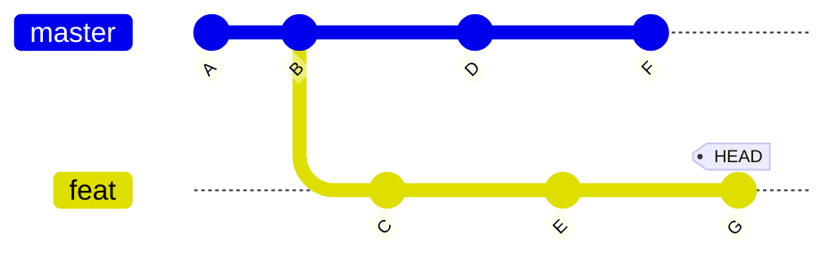
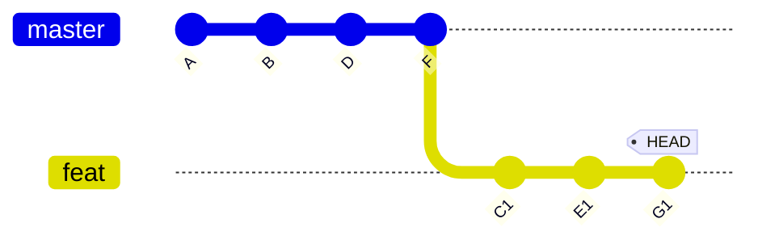

+++
title = 'Git Advanced Usage: Merging'
date = 2024-08-06T12:00:00-07:00
draft = true
tags = ["git-en", "git", "tutorial", "tutorial-en"]
showToc = true
+++

In the [previous article](/blog/git-basic-usage-en), we've introduced the
basic usage of Git. In this article, we will introduce the advanced usage
on merging branches.

<!--more-->

Using multiple branches, which can make your workflow more flexible and
efficient, is a common practice in Git. However, it is not easy for a
beginner to leverage the features of branches, especially the features
related to merging. If you don't have a good understanding of all the
crucial commands and concepts, then you will get disoriented when you
encounter a problem when handling multiple branches.

This article will assume that you have a good command of the basic usage,
which is introduced in the
[previous article](/blog/git-basic-usage-en). To be specific,
you should be familiar with the stuff listed in the
[recap section](/blog/git-basic-usage-en#recap).

## Merge Branches

**Key rule: Always do your work in your own branch.**

Git is designed for distributed purpose, so your own branch is the branch
that you should focus on. Every time you want to do something (e.g., `merge`
or `rebase`), doing it in your own branch is always a good practice. We
will give more examples in the `git rebase` section.

Git provides two ways to merge branches:

- [Merge](#merge)
- [Rebase](#rebase)

Each method has its own pros and cons, and have difference in terms of the
workflow. You should use the appropriate one based on your situation (e.g.,
personal preference, team rules, etc.).

Conflicts may occur when merging if both sides have modified the same part
of the file. We will discuss about how to resolve conflicts later in this
article.

### Merge

There are basically two behaviours of "merge" command:

- **Fast-forward merge**. If `HEAD` is the ancestor of the branch to be
  merged, Git will only move `HEAD` to the branch to be merged. You can
  use `--ff-only` option to force this behaviour. The graph below depicts
  the fast-forward merge. If we are in the `master` branch and want to
  merge the `feat` branch, the `HEAD` will move to the `feat` branch, that
  is to say, moves from `old HEAD` position to `new HEAD` position.

  ```mermaid
  %%{init: {'gitGraph': {'mainBranchName': 'master'}} }%%
  gitGraph
    commit
    commit tag: "old HEAD"
    branch feat
    commit
    commit tag: "new HEAD"
  ```

- **3-way merge**. If `HEAD` is not the ancestor of the branch to be merged,
  Git will create a new commit to merge the two branches. The graph below
  depicts the 3-way merge. In this case, Git will create a new commit to
  merge the two branches, where the new commit has two parents -- the last
  commit of the branch to be merged and the commit you are previously on.

  ```mermaid
  %%{init: {'gitGraph': {'mainBranchName': 'master'}} }%%
  gitGraph
    commit
    commit tag: "old HEAD"
    branch feat
    checkout master
    commit
    checkout feat
    commit
    commit
    checkout master
    merge feat tag: "new HEAD"
  ```

To merge branches, you can use the following command:

```bash
git merge <commit>...
```

> For example, if you are in the `master` branch and want to merge the
> `feat` branch, you can use the following command:
>
> ```bash
> git merge feat
> ```

Please note that:

- The `<commit>` parameter can be a commit hash or any reference to a commit.
- The number of commits to be merged can be more than one.
- If no commits are specified, Git will merge the remote-tracking counterpart
  of the current branch.
- Use `--ff-only` option to force fast-forward merge (e.g.,
  `git merge --ff-only feat`).
- Use `--squash` option (e.g., `git merge --squash feat`) if you want to
  merge without creating a new commit or to avoid creating a merge commit
  (which means there's more than one parents).

We will discuss later about how to resolve conflicts when merging branches.

Pros:

- Not affecting the previous commits, including committer, author(s) and
  signature(s).

Cons:

- The relationship between commits is complicated and not clear enough.
- When merging a branch with a large number of commits, the conflict
  resolution process may be complicated as opposed to the rebase case.
  This is because rebase process will apply commits one by one, so it is
  finer-grained.

### Rebase

Rebase is a little bit different from merge. If the commit relationship is
like the following graph:



Then, after rebasing the `master` branch on the `feat` branch, the graph
will be like this:



As you can see, the `feat` branch is rebased on the `master` branch, and
the commit `C`, `E`, `G` have been applied to the latest commit of the
`master` branch. The `C1`, `E1`, `G1` are the new commits created by the
rebase operation.

The rebase operation basically applies all the affected branch, which
includes all the branch from the shared ancestor to the current branch,
to the branch-to-be-rebased one by one. This is why it is called rebase,
because it set the base of the current branch to the branch-to-be-rebased.

Please note that you should be the **only** maintainer on the branch on
which you are rebasing. Otherwise, you will probably encounter a lot of
problems.

To rebase branches, you can use the following command:

```bash
git rebase <commit>...
```

> For example, if you are in the `master` branch and want to merge the
> `feat` branch, you can use the following command:
>
> ```bash
> git merge feat
> ```

Please note that:

- The `<commit>` parameter can be a commit hash or any reference to a commit.
- The number of commits to be merged can be more than one.
- If no commits are specified, Git will merge the remote-tracking counterpart
  of the current branch.
- If a conflict occurs, you should resolve it and then use `git rebase
  --continue` to continue the rebase operation. We will discuss about how
  to resolve conflicts later in this article.

If you want to use more features, you can use the `-i` or `--interactive`
option. This option will open an editor and allows you to the following
operations:

- Pick (`p <commit>`): use the commit.
- Reword (`r <commit>`): use the commit, but edit the commit message.
- Edit (`e <commit>`): use the commit, but stop for amending.
- Squash (`s <commit>`): use the commit, but meld into the previous commit.
- Fixup (`f <commit>`): like "squash" but keep only the previous commit's
  log message.
- Execute (`x <command>`): run command (the rest of the line) using shell.
- Break (`b`): stop here (continue rebase later with `git rebase --continue`).
- Drop (`d <commit>`): remove commit.
- Label (`l <label>`): label current `HEAD` with a name.
- Reset (`t <label>`): reset `HEAD` to a label.
- Merge (`m [-C <commit> | -c <commit>] <label> [# <oneline>]`): create a
  merge commit using the original merge commit's message.
- Update-ref (`u <ref>`): track a placeholder for the `<ref>` to be updated
  to this position in the new commits.

Pros:

- The created commits are kept as a chain, which is clear and easy to
  understand compared to the merge case.
- If the commit to be merged has a great difference from the current branch,
  the conflict resolution will be easier in that the rebase process applies
  the commits one by one.

Cons:

- Any commits to be applied during rebasing will lose their original
  committer (as well as their signatures) if their committer are not the
  person who operates the rebase procedure.
- If there are two or more people working on the same branch, the branch
  will probably not be up to date, which means you have to cherry-pick
  the commits manually. (You will not encounter this problem if you are
  the only maintainer of the branch.)
- More conflicts may occur, but the case is rare.

### Resolve Conflicts

> As long as we need to merge, the conflicts will always be there.

When merging branches, Git will tell you if the automatic merge failed,
and you have to resolve the conflicts manually.

You can know the status of the merge with `git status` command. In the
files with conflicts, you will see something like the following message:

```plaintext
<<<<<<< HEAD
...
||||||| b6279c7
...
=======
...
>>>>>>> feat
```

The first `...` is the content of the current `HEAD`; the second `...` is
the content of the shared ancestor; the third `...` is the content to be
merged.

You may use other tools (e.g., [delta project][delta-project]) to show the
conflicts in a more intuitive way, which will be introduced in the coming
articles.

[delta-project]: https://github.com/dandavison/delta

If you use the rebase strategy, it is easier to resolve the conflicts,
because the changes in every commit is finer-grained and has a clear
intention (the changes are applied commit by commit).

After resolving the conflicts, you should use the following command depending
on your merge strategy:

- For merge strategy, add the resolved files (i.e., `git add <file>`) and
  then create a new commit (i.e., `git commit`).
- For rebase strategy, add the resolved files (i.e., `git add <file>`) and
  then continue the rebase operation (i.e., `git rebase --continue`).

There are some other tricks:

- Abort: `git merge --abort`, `git rebase --skip`, `git rebase --abort`
  (depending on the strategy you are using).
- Follow others: `git merge -s theirs ...`.
- Insist on your own: `git merge -s ours ...`.

### Example of Common Workflow

Let's assume that the main branch is `master` while the feature branch is
`feat`. We need to merge the `feat` branch into the `master` branch, but
the `master` branch cannot merge the `feat` branch in a fast-forward way.

- Merge strategy: merge the `feat` branch on the `master` branch.

  It is recommended to switch to the `feat` branch and then merge the
  `master` branch into the `feat` branch in a fast-forward way. This will
  make the `feat` branch up to date with `master`. If you don't do this,
  nothing will happen in the near future, but as the changes are accumulating,
  conflicts or other problems (e.g., not working but no conflicts) will be
  more likely to occur.
- Rebase strategy: rebase the `master` branch on the `feat` branch, then
  switch to the `master` branch and merge the `feat` branch in a fast-forward
  way.
